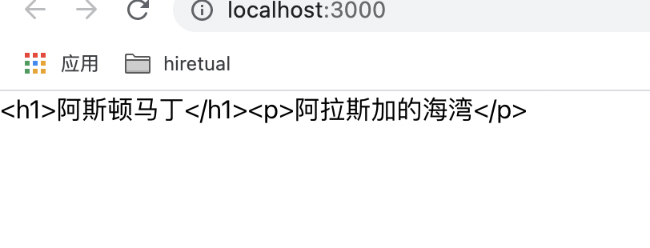
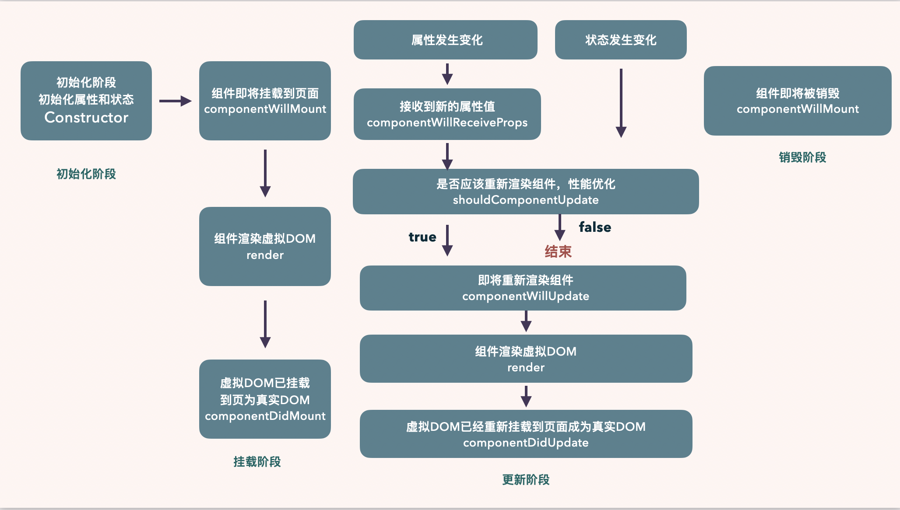
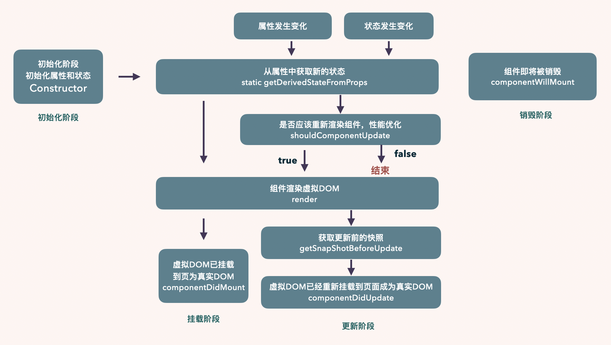
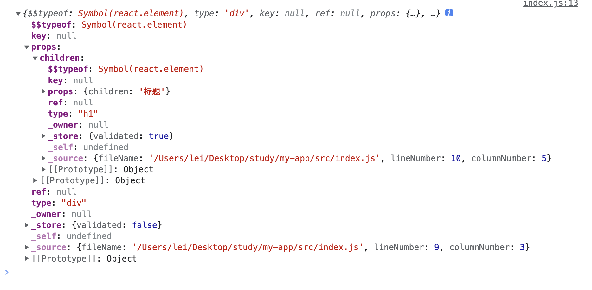

# react是什么？

**讲概念 说用途 理思路 优缺点**

**采用非线性的结构化模式阐述答案**

+ 讲概念： 技术本质
+ 说用途：简短说明技术用途
+ 理思路：概要说明核心技术思路
+ 优缺点：
  - 独特优势
  - 个别缺点


React中只有组件，没有页面，没有控制器，也没用模型

React只关心两件事，数据与组件

React的核心思路：声明式，组件化，通用性

React将Dom声明为虚拟Dom，

声明式编程的优势在于直观，可以做到一目了然，也便于组合

组件化可以降低系统间功能的耦合性，提高功能内部的聚合性

<u>React是一个网页UI框架，通过组件化的方式解决视图层开发复用的问题，本质是一个组件化框架。</u>

<u>他的核心思路有三点，分别是声明式，组件化与通用性。</u>

<u>声明式的优势在于视图的拆分与模块的复用，可以更容易做到高内聚低耦合</u>

<u>通用性在于一次学习，随处编写。比如React Native，React 360等，这里主要靠虚拟Dom来保证实现。</u>

React主要用于构建UI。你可以在React里传递多种类型的参数，如声明代码，帮助你渲染出UI、也可以是静态的HTML DOM元素、也可以传递动态变量、甚至是可交互的应用组件。

Vue.js 是一套构建用户界面的渐进式框架。 Vue 只关注视图层, 采用自底向上增量开发的设计。


命令式方法的一个常见示例是使用jQuery或DOM事件在DOM中查找元素。 您告诉浏览器确切的操作，而不是告诉浏览器您需要什么。

React声明式方法为我们抽象了这一点。 我们只是告诉React我们希望组件以特定的方式呈现，并且我们以后不必再与DOM交互来引用它。


# 声明式编程

- 声明式编程是告诉计算机需要计算“什么”而不是“如何”去计算
- 任何没有[副作用](https://baike.baidu.com/item/副作用)的编程语言，或者更确切一点，任何引用透明的编程语言
- 任何有严格计算逻辑的编程语言

个人理解： 因为react用的是虚拟dom，虚拟dom映射到浏览器，告知浏览器我需要这样的一个结构，然后你去渲染吧，操作dom的时候，react 虚拟dom的结构发生改变，发生改变以后，再次告诉浏览器，我需要的结构改变了，通过diff算法，在浏览器中映射这一部分元素，只重新渲染这一部分


# 为什么react要用jsx？


**为什么不用其他的？**

三部曲：一句话解释jsx，核心概念，方案对比

没有JSX的时候

```js
class Hello extends React.Component{
    render() {
        return React,createElement(
            'div',
             null,
             `Hello ${this.props.toWhat}`
        );
    }
}

ReactDOM.render(
    第一个参数是组件名，第二个参数是props对象，第三个参数，不知道
	React.createElement(Hello, {toWhat: 'World'}, null),
    document.getElementById('root')
);
```


Babel插件如何实现JSX到JS的编译？

```js
module.exports = function(babel) {
    var t = babel.types;
    return {
        name: "custom-jsx-plugin",
        visitor: {
            JSXElement(path) {
                var openingElement = path.node.openingElement;
                var tagName = openingElement.name.name;
                var args = [];
                args.push(t.stringLiteral(tagName)); 
                var attribs = t.nullLiteral(); 
                args.push(attribs); 
                var reactIdentifier = t.identifier("React"); //object
                var createElementIdentifier = t.identifier("createElement"); 
                var callee = t.memberExpression(reactIdentifier, createElementIdentifier)
                var callExpression = t.callExpression(callee, args);
                callExpression.arguments = callExpression.arguments.concat(path.node.children);
                path.replaceWith(callExpression, path.node); 
            }
        }
    }
}

```


# 如何避免生命周期中的坑？


+ 在不恰当的时机调用了不合适的代码
+ 在需要调用的时候，却忘记了调用

通过梳理生命周期，明确周期函数的职责，确认什么时候该做什么事儿，以此来避免坑


当我们在讨论React组件生命周期的时候，一定是在讨论类组件（Class Component）。

函数式组件没有生命周期的概念，因为它本身就是一个函数，只会从头执行到尾


### 以下三种情况会触发重新渲染

#### 函数组件

函数组件在任何情况下都会重新渲染。他并没有声明周期，但官方提供了一种方式优化手段，那就是React.memo。

```js
const MyComponent = React.memo(function MyComponent(props) {
  /* 使用 props 渲染 */
});
```

React.memo 并不是阻断渲染，而是跳过渲染组件的操作并直接复用最近一次渲染的结果，这与 shouldComponentUpdate 是完全不同的。


#### React.component

如果不使用 **shouldComponent** 函数，那么有两种情况触发重新渲染。

1. 当state发生变化时。
2. 当父级组件的props传入时，无论props有没有变化，只有传入就会引发重新渲染


#### React.PureComponent

**PureComponent** 默认实现了**shouldComponentUpdate** 函数。所以仅在props与state浅比较后，确认有变更时才会触发重新渲染。


点击按钮没有反应

```jsx
import React, { Component, PureComponent } from 'react'


class Child extends PureComponent{
    render() {
        console.log('child'); // 只在组件刚开始挂载的时候，打印一下，点击按钮的时候不会打印
        return (
            <div> {this.props.person.username} </div>
        )
    }
}

export default class shouldCom extends Component {
    state = {
        username: '用户名',
        person: {
            username: '修改'
        }
    }

    change = () => {
        let {person} = this.state;
        person.username = '改过来了';
        this.setState({
            person
        })
    }

    render() {
        return (
            <div>
                <Child person={this.state.person} />
                <button onClick={this.change}>修改</button>  // 点击按钮child组件不会重新渲染
            </div>
        )
    }
}

```


点击按钮有反应，child组件会重新渲染

```jsx
import React, { Component, PureComponent } from 'react'


class Child extends PureComponent{
    render() {
        console.log('child');
        return (
            <div> {this.props.username} </div>
        )
    }
}

export default class shouldCom extends Component {
    state = {
        username: '用户名',
        person: {
            username: '修改'
        }
    }

    change = () => {
        let {person} = this.state;
        person.username = '改过来了';
        this.setState({
            person
        })
    }

    render() {
        return (
            <div>
                <Child username={this.state.person.username} />
                <button onClick={this.change}>修改</button>
            </div>
        )
    }
}

```


#### React.memo

和 PureComponent 一样，只能监测一层

memo: 针对整个组件是否重新渲染

useMemo useCallback : 针对的是一段程序

```jsx
import React, { Component, PureComponent, memo } from 'react'


// class Child extends PureComponent{
//     render() {
//         console.log('child');
//         return (
//             <div> {this.props.username} </div>
//         )
//     }
// }

const Child = memo((props) => {
    console.log('child');
    return (
        <div> {props.username} </div>
    )
})

export default class shouldCom extends Component {
    state = {
        username: '用户名',
        person: {
            username: '修改'
        }
    }

    change = () => {
        let {person} = this.state;
        person.username = '改过来了';
        this.setState({
            person
        })
    }

    render() {
        return (
            <div>
                <Child username={this.state.person.username} />
                <button onClick={this.change}>修改</button>
            </div>
        )
    }
}
```


#### 错误边界

错误边界是一种React组件。这种组件可以捕获并打印发生在其子组件树任何位置的JavaScript错误并且它会渲染出备用UI。如下React官方所给出的示例：

```jsx
class ErrorBoundary extends React.Component {
    constructor(props) {
        super(props);
        this.state = {
            hasError: false
        }
    }
    
    static getDerivedStateFromError(error) {
        // 更新state使下一次渲染能够显示降级后的 UI
        return {hasError: true};
    }
    
    // 渲染时的报错，只能通过 componentDidCatch 捕获
    componentDidCatch(error, errorInfo) {
        // 将错误日志上报给服务器
        logErrorToMyService(error, errorInfo);
    }
    
    render() {
        if(this.state.hasError) {
            // 自定义降级后的UI并渲染
            return <h1>Something went wrong</h1>
        }
        return this.props.children
    }
}
```


无论是React，还是React Native, 如果没有错误边界，在用户侧看到的现象会是这样的：在执行某个操作时，触发了bug，引发了崩溃，页面突然白屏。

需要注意的是，渲染时的报错，只能通过 componentDidCatch 捕获


> 避免生命周期中的坑需要做两件事：
>
> + 不在不恰当的时间调用不该调用的代码
> + 在需要调用的时候，不要忘了调用


> 主要有七种情况容易造成生命周期中的坑：
>
> + **getDerivedStateFromProps ** 容易编写反模式代码，使受控组件和非受控组件区分模糊
> + **componentWillmount**  已被标记弃用，不推荐使用，主要原因是新的异步渲染构架会导致它被多次调用。所以网络请求及事件绑定代码应该移至  **componentDidMount**  中。
> + **componentWillReceiveProps ** 同样被标记弃用，被 **getDerivedStateFromprops** 所取代，只要原因是性能问题。
> + **shouldComponentUpdate** 通过返回true或者false来确定是否需要触发新的渲染。主要用于性能优化
> + **componentWillUpdate** 同样是由于新的异步渲染而被标记弃用，不推荐使用，原先的逻辑可结合**getSnapshotBeforeupdate** 与 **componentDidUpdate** 改造使用。
> + 如果在 **componentWillUnmount** 函数中忘记解除事件绑定，取消定时器等操作，容易引发bug
> + 如果没有添加错误处理边界，当渲染发生异常时，用户将会看到一个无法操作的白屏，所以一定要添加。

### React请求应该放在哪里？为什么？

对于异步的请求，应该放在componentDidMount中操作。从时间顺序来看，除了componentDidMount还能有以下选择：

+ constructor: 可以放，但从设计上而言不推荐。constructor主要是用于初始化state与函数绑定，并不承载业务逻辑。而且随着类属性的流行，constructor已经很少使用了。
+ componentWillMount： 已被标记废弃，在新的异步渲染架构下会触发多次渲染，容易引发bug，不宜与未来React升级后的代码维护


所以React的请求放在**componentDidMount** 里是最好的选择。


# 类组件与函数组件的区别？

+ 了解两种组件的编写模式
+ 具备在合适的场景下选用合适技术栈的能力

### 函数式组件

> 纯展示组件

+ 没有生命周期
+ 没有状态
+ 没有this
+ 解析快

### 类组件

+ 有生命周期
+ 有状态
+ this
+ 解析慢

## 相同点

组件是React可复用的最小代码片段，他们会返回要在页面中渲染的React元素。因为组件是React的最小编码单位。所以无论是函数组件还是类组件，在使用方式和最终呈现效果上都是完全一致的。

## 不同点

### 基础认知

#### 类组件和函数组件本质上代表了两种不同的设计思想和心智模式

+ 类组件的根基是 OOP（面向对象编程），所以他有继承、有属性、有内部状态的管理
+ 函数组件的根基是FP，也就是函数式编程。它属于“结构化编程”的一种，与数学函数思想类似。也就是假定输入与输出存在某种映射关系，那么输入一定的情况下，输出必然是确定的。


**相较于类组件，函数组件更纯粹，简单，已测试**。 这是它们本质上最大的不同。

有一个广为流传的经典案例，是这样描述函数组件的确定性的（有的文章会将这种确定性翻译为函数组件的 **值捕获特性**），案例中的代码是这样的： 

```jsx
const Profile = (props) => {
    const showMessage = () => {
        alert('用户是' + props.user);
    };
    const handleClick = () => {
        setTimeout(showMessage, 3 * 1000);
    };
    return (<button onClick={handleClick}>查询</button>)
}
```


由于没有查询接口，所以通过setTimeout来模拟网络请求。

那如果通过类组件来描写，我们大致上会这样重构：

```jsx
class Profile extends React.component{
    showMessage = () => {
        alert('用户是' + this.props.user)
    }
	handleClick = () => {
        setTimeout(this.showMessage, 3 * 1000)
    }
    render() {
        return <button onClick={handleClick}>查询</button>
    }
}
```


表面上看这两者是等效的。正因为存在这样的迷惑性，所以这也是此案例会如此经典的原因。

接下来就非常神奇了，也是这个案例的经典步骤：

+ 点击其中某一个查询按钮；
+ 在3秒内切换选中的按钮；
+ 查看弹框的文本

```jsx
import React, { Component } from 'react';
import ProfileFunction from './ProfileFunction';
import ProfileClass from './ProfileClass';

export default class App extends Component {
    state = {
        user: '小明',
    }
    render() {
        return (
            <div>
                <label>
                    <b> : </b>
                    <select
                        value={this.state.user}
                        onChange={e => this.setState({user: e.target.value})}
                    >
                        <option value="小明">Dan</option>
                        <option value="小白">Sophie</option>
                        <option value="小黄">Sunil</option>
                    </select>
                </label>
                <p>
                    <ProfileFunction user={this.state.user} />
                    <b> (function) </b>
                </p>

                <p>
                    <ProfileClass user={this.state.user} />
                    <b> (class) </b>
                </p>
            </div>
        )
    }
}

```

这时，会看到一个现象：

+ 使用函数组件时，当前账号是小白，点击查询按钮，然后立马将当前账号切换成小黄，但弹框显示的内容依然是小白；
+ 而当使用类组件是，同样的操作下，弹框显示的是小黄。

就是类组件会很快的发生变化，而函数组件不会

为什么会这样呢？

因为当切换下拉框后，新的user作为props传入了类组件中，所以此时组件内的user已经发生了变化。

如下代码所示：

```jsx
showMessage = () => {
    alert('用户是' + this.props.user)
}

// 这里的this存在一定的模糊性，容易引起错误使用。如果希望组件正常运行，那么我们可以这样修改：
showMessage = (user) => {
    alert('用户是' + user)
}
handleClick = () => {
    const {user} = this.props;
    setTimeout(() => this.showMessage(user), 3 * 1000)
}

```

但是在函数组件的闭包中，这就不是问题，他捕获的值永远是确定且安全的。


### 独有能力

#### 类组件通过生命周期包装业务逻辑，这是类组件特有的。

```jsx
class A extends React.component{
    componentDidMount() {
        fetchPosts().then(posts => {
            this.setState({ posts });
        })
    }
    render() {
        return ...
    }
}
```

在还没有hooks的时代，函数组件的能力是比较弱的。在那个时候尝尝用高阶组件包裹函数组件模拟声明周期。当时流行的解决方案是Recompose。

如下代码所示：

```jsx
const PostsList = ({ posts }) => (
    <ul>{ posts.map(p => <li>p.title</li>) }</ul>
)

const PostsListWithData = lifecycle({
    componentDidMount() {
        fetchPosts().then(posts => {
            this.setState({ posts })
        })
    }
})(PostsList)
```

这一解决方案在一定程度上增加了函数组件的能力，但它并没有解决业务逻辑掺杂在生命周期中的问题。Recompose 后来加入了React团队，参与了Hooks标准的制定，并基于Hooks创建了一个完全耳目一新的方案。

这个方案从全新的角度解决问题： 不是让函数组件去模仿类组件的功能，而是提供新的开发模式让函数组件渲染与业务逻辑更分离。设计出如下代码：

```jsx
import React, {useState, useEffect} from 'react';

function App() {
    const [data, setData] = useState({ posts:[] });
    useEffect(() => {
        (async () => {
            const result = await fetchPosts();
            setData(result.data);
        })()
    }, []);

    return (
        <ul>{ data.posts.map(p => <li>{p.title}</li> ) }</ul>
    )
}

export default App;

```


### 使用场景

在设计模式上，因为类本身的原因，类组件是可以实现继承的，而函数组件缺少继承的能力。

当然在React中也是不推荐继承已有的组建的，因为继承的灵活性更差，细节屏蔽过多，所以有这样一个铁律，**组合优于继承** 。详细的设计模式会在之后具体讲解


### 性能优化

+ 类组件的优化主要依靠 **shouldComponentUpdate** 去阻断渲染
+ 函数组件一般靠React.memo来优化。React.memo并不是去阻断渲染，他具体的作用在之前的内容中。（三种情况会触发渲染中，函数组件的方式中有React.memo）


### 未来趋势

由于React Hooks 的推出，函数组件成了社区未来主推的方案。

React 团队从 Factbook 的实际业务出发，通过探索时间切片与并发模式，以及考虑性能的进一步优化与组件间更合理的代码拆分结构后，认为类组件的模式并不能很好的适应未来的趋势。

他们给出了三个原因：

+ this的模糊性
+ 业务逻辑散落在生命周期中
+ React的组件代码缺乏标准的拆分方式

而使用Hooks的函数组件可以提供比原先更细粒度的逻辑组织与复用，且能更好地适用于时间切片与并发模式


## 区别

> 作为组件而言，类组件与函数组件在使用上没有呈现任何不同，性能上在现代浏览器中也不会有差异
>
> 它们在开发时的心智模型上却存在巨大的差异。类组件是基于面向对象编程的，它主打的是继承，生命周期等核心概念；而函数组件内核是函数式编程，主打的是immutable(**不变的；不可变的；不能变的**)，没有副作用，引用透明等特点
>
> 之前，在使用场景上，如果存在需要使用生命周期组件，那么主推类组件；设计模式上，如果需要继承，那么主推类组件
>
> 但现在由于React Hooks 的推出，生命周期概念的淡出，函数组件可以完全取代类组件。
>
> 其次继承并不是组件最佳的设计模式，官方更推崇“组合优于继承”的设计概念，所以类组件在这方面的优势也在淡出。
>
> 性能优化上，类组件主要依靠shouldComponentUpdate 阻断渲染来提升性能，而函数组件依靠 React.memo缓存渲染结果来提升性能
>
> 从上手程度而言，类组件更容易上手，从未来趋势来看，由于React Hooks 的土池，函数组件成了未来社区主推方案。
>
> 类组件在未来时间切片与并发模式中，由于生命周期带来的复杂度，并不易于优化。而函数组件本身轻量简单，且在Hooks 基础上提供了比原先更细粒度的逻辑组织与复用，更能适应React的未来发展

函数式组件，没有内部状态，没有生命周期，解析快

类组件，有内部状态，有生命周期，解析慢

# 如何设计React组件

React组件有哪些分类？可以直接采用React社区中非常经典的分类模式：

+ 把值作展示，独立运行，不额外增加功能的组件，成为**哑组件**，或**无状态组件**，还有一种叫法是展示组件；
+ 把处理业务逻辑与数据状态的组件成为**有状态组件** ，或 **灵巧组件**， **灵巧组件** 一定包含至少一个灵巧组件或展示组件。

从分类中可以看出 **展示组件的复用性更强，灵巧组件则更专注于业务本身**。

## 展示组件

展示组件内部是没有状态管理的，正如其名，就像一个个装饰物一样，完全受制于外部的props控制。战术组件具有极强的通用性，复用率也很高，往往与当前的前端工程关系相对薄弱，甚至可以做到跨项目级的复用。

### 代理组件

代理组件常用于封装常用属性，减少重复代码。关于代理组件你应该不陌生，可能经常会写。

举一个最常见的例子，当需要定义一个按钮的时候，需要在按钮上添加 button 属性，代码如下：

```html
<button type="button"></button>
```


当然在React中使用的时候，不可能每次都写这样一段代码，非常麻烦，常见的做法是封装：

```jsx
const Button = props => <button type="button" {...props}></button>
```

在开发中使用Button组件代替原生的button，可以确保type一致。

在使用App开发时，也可以采用类似的设计模式，大致情况如下：

```jsx
import {Button as AntdButton} from 'antd'

```


# React Hooks


hook 是 react16.8 的新增特性。他可以让我们在不便携class 的情况下使用 state 以及其他的 react 特性。

> **注：hook 只能在函数式组件内使用，不能在类组件内使用**


## 类组件的缺点

+ 逻辑复用难
  + 缺少复用机制
  + 渲染属性和高阶组件导致层级冗余
+ 趋向复杂难以维护

  + 生命周期函数混杂不相干逻辑
  + 相干逻辑分散在不同生命周期

+ this指向困扰
  + 内联函数过渡创建新句柄
  + 类成员不能保证this


# Virtual Dom 的工作原理是什么？

js的渲染速度比html渲染的快，操作虚拟dom比真实dom方便


## 讲解概念

虚拟 dom 的工作原理 是通过js 对象模拟dom 中的节点。 

虚拟 dom 是描述真实dom 的就是对象

## 说用途

在Facebook构建react的初起，考虑到要提升代码抽象能力，避免人为的dom操作，降低代码整体风险，所以引入虚拟dom


## 理思路

虚拟dom，是通过js对象模拟dom中的节点，而js对象是react.createElement 的返回值，虚拟 DOM 在实现上通常是 Plain Object，以 React 为例，render 函数中的 jsx 会在 babel 插件的作用下，编译为 react.createElement 执行 jsx 中的属性参数


React.createElement 执行后返回一个 plain Object [pleɪn]  【纯对象(plain object)，，即使用{}或者new Object创建的对象】，他会描述自己的tag类型，有哪些属性，以及有哪些子元素。这些plain Object 通过树形结构生成一颗dom树。当状态要发生改变时，将变更前后的虚拟dom树进行差异比较，这个过程称为diff，生成的结果称为patch [pætʃ] 【补丁，修补文件】。计算之后，会渲染patch完成对真实 dom 的操作


## 优点

+ 改善大规模Dom操作的性能，
+ 规避XSS风险，
+ 能以较低成本实现跨平台开发。当 React 向 iOS、Android 开发时，只需要通过 React Native 提供 Native 层的元素渲染即可完成。


## 缺点

+ 内存占用较高 

  > 因为当前网页的虚拟 DOM 包含了真实 DOM 的完整信息，而且由于是 Object，其内存占用肯定会有所上升。

+ 高性能应用场景难以优化 

  > 例如 Google Earth 这类的 高性能前端应用 在技术选型上 往往不会选择 React


## 讨论边界

### 虚拟 DOM 一定比真实的 DOM 操作性能更高吗

如果是只是修改一个按钮的文案，虚拟dom 的操作怎么都不会比真实的dom操作快，

所以一定要在具体的场景下面讨论

大量的操作dom会导致网页性能的操作下降，这是react基于虚拟dom 的diff 处理 与 批处理操作，可以降低dom 的操作范围与频次，提成页面性能，这时虚拟dom的渲染速度就比真实dom快，


如果是首屏加载 或 微量操作，虚拟dom 的渲染速度就会比真实dom慢


### 虚拟dom就一定会避开xss吗？

不一定，虚拟dom内部 确实有一个字符转义，所以确实可以做到这一点

但react 中存在风险，因为 react 留有 dangerouslySetInnerHTML API绕过转义


### 没有虚拟dom就不能实现跨平台吗？

比如 NativeScript 就没有虚拟dom，它是通过提供兼容原生 API 的 JS API 实现跨平台开发


### 虚拟dom的优势在哪里

跨平台的成本更低


# 与其他框架相比，react的diff算法有何不同

## 其他框架

+ vue
+ 类react框架，又被成为react-like框架，通常是指 Preact、inferno 等兼容react api 的框架


## react的diff算法

diff 算法会比较前后的虚拟dom，从而得到patches（补丁），然后与老的虚拟dom做对比，将其应用在需要更新的地方，得到新的虚拟dom，


### 大致流程

现在有一个真实的dom，首先会映射为虚拟dom，这个时候，我们删除了最后一个p节点和son2节点，得到一个新的虚拟dom，新的虚拟dom会和旧的虚拟dom进行差异对比，得到了patches对象，之后，对旧的真实dom进行操作，得到新的dom


### diff 的几种策略

+ web ui 中 dom 节点跨层级的移动操作特别少，可以忽略不计
+ 拥有相同类的两个组件将会生成相似的树形结构，拥有不同类的两个组件将会


# 袁进部分


## 直接在页面上引用js

### ReactDOM.render()

负责把react元素渲染到页面上。

#### 参数

##### 参数1: 在页面上要展示的内容

##### 参数2: 显示内容的元素

```html
<body>
  <div id="root"></div>
  <script src="https://unpkg.com/react@17/umd/react.development.js" crossorigin></script>
  <script src="https://unpkg.com/react-dom@17/umd/react-dom.development.js" crossorigin></script>
  <script>
    // 应该先引入react 再引入 react-dom，因为react-dom依赖于react核心库
    // ReactDOM.render() 是react-dom的函数，接受两个参数 ReactDOM.render(在页面上要展示的内容，显示内容的元素)
  	ReactDOM.render('Hello World', document.getElementById('root'))
  </script>
</body>
```


>crossorigin 的用处：
>
>> 有的元素自身的src属性可以实现跨域，去访问其他资源。但是如果跨域报错的话，不会显示详细信息。加上 crossorigin 可以让报错信息显示，知道哪里报错
>
>react.development:
>
>> 开发版本，react核心库，不依赖宿主环境。可以用于网页，手机，或桌面应用，或小程序
>
>react-dom.development:
>
>> react-dom 开发版本，依赖于核心库，将核心库的功能与页面结合


### React.createElement()

如何创建元素，放到另一个元素里面

核心库里面有一个React对象，这个对象上面有一个createElement方法，用这个方法来创建元素，这里注意创建的是react元素对象，称作虚拟dom，本质上是一个对象，不是dom对象。

#### 参数

##### 参数1：元素类型，如果是字符串，表示一个简单的html元素

##### 参数2:   元素的属性

##### 后续参数（...rest）： 元素的字节点

React.createElement() 创建一个react元素，ReactDOM.render()把react元素变成一个真实的dom对象

```html
<body>
  <div id="root"></div>
  <script src="https://unpkg.com/react@17/umd/react.development.js" crossorigin></script>
  <script src="https://unpkg.com/react-dom@17/umd/react-dom.development.js" crossorigin></script>
  <script>
    
    // 创建一个span元素分
    var span = React.createElement('span', {}, '一个span元素')

    // 第一步，创建一个react元素,虚拟dom
    var h1 = React.creteElement('h1', {
      title: '第一个react元素'
    },'Hello', 'World'， span)
    console.log(h1); // 打印出来react虚拟dom对象。
    
    // 第二步，把react元素分变成真实的dom对象
    ReactDOM.render(h1, document.getElementById('root'))
    
  </script>
</body>
```


### 浅识JSX

js 的扩展语法，需要使用babel进行转义，因为标准js不支持jsx语法

为什么要有jsx？


```html
<body>
  <div id="root"></div>
  <script src="https://unpkg.com/react@17/umd/react.development.js" crossorigin></script>
  <script src="https://unpkg.com/react-dom@17/umd/react-dom.development.js" crossorigin></script>
  <!-- 引入babel，编译jsx -->
  <script src="https://unpkg.com/@babel/standalone/babel.min.js"></script>
  
  <!-- 一直以来，type属性的默认值是	"text/javascript", 现在是 "text/babel",告知浏览器，这一部分可以不管，由babel进行编译 -->
  <script type="text/babel">
  
  	// 创建一个span元素
    // var span = React.createElement('span', {}, '一个span元素')
		var span = <span>这是一个span元素</span> // babel 会把这行代码，转换成上面的形式
		
    // 第一步，创建一个react元素,虚拟dom
    // var h1 = React.creteElement('h1', {
    //   title: '第一个react元素'
    // },'Hello', 'World'， span)
    var h1 = <h1>Hello World <span>这是一个span元素</span></h1>
    console.log(h1)
    
    // 第二步，把react元素分变成真实的dom对象
    ReactDOM.render(h1, document.getElementById('root'))
    
    // 这里的 h1 会被编译成 React.createElement() 是什么意思呢？
    
    // h1 会被编译成下面这种结构
    React.createElement('h1', {}, 'Hello World ', React.createElement('span', {}, '这是一个span元素'))
    
    // 这个需要注意的是，h1，只有一个根结点，所以jsx语法只能有一个根结点，因为React.createElement 没办法一次生成两个元素，就意会  		// 吧
    
  </script>
</body>
```


**JSX 只有一个根节点，平常写的空标签<></>,相当于<React.Fragment></React.Fragment>**


```jsx
var h1 = (
	<React.Fragment>
    <div></div>
    <span></span>
  </React.Fragment>
)
```


## 使用脚手架搭建工程

官方： create-react-app

第三方：next.js   umijs


# JSX


## 什么是JSX

- Facebook 起草的 JS 扩展语法
- 本质是一个对象，会被babel编译，最终会被转换为React.createElement
- 每个 JSX 表达式，有切直邮一个根节点
- 每个 JSX 元素必须结束（XML 规范）


## 在JSX中嵌入表达式

+ 将表达式作为内容的一部分
  ```jsx
  import React from 'react';
  import ReactDOM from 'react-dom';
  
  const a = 123,
        b = 456;
  
  const div = ( // 括号代表里面的内容是个表达式
  	<div> {a} * {b} = {a * b} </div>
  )
  ReactDOM.reander(div, document.getElementById('root'));
  // 相当于
  // div = React.crateElement('div', {}, `${a} * ${b} = ${a * b}`);
  // ReactDOM.reander(div, document.getElementById('root'));
  ```

  + 如果表达式的结果为 null 或者 undefined 或者 false 不会显示到页面上

    ```jsx
    import React from 'react';
    import ReactDOM from 'react-dom';
    
    const a = null;
    
    const div = ( // 括号代表里面的内容是个表达式
    	<div> {a} <p>{undefined} {false} </p>  <span> {'undefined'} </span> </div> 
      {/* 标签会被渲染到页面上，但是标签里面没有内容 */}
    )
    ReactDOM.reander(div, document.getElementById('root'));
    
    ```

  + 普通对象不能作为子元素 (React 元素对象才可以)

    ```jsx
    
    import React from 'react';
    import ReactDOM from 'react-dom';
    
    const obj = {
      name: 'zhang',
      age: 13
    };
    
    const reactObj = <span>我是一个span</span>
    
    const div = ( 
      <>
    		<div>{obj}</div> 
      	{reactObj}
      </>
    )
    ReactDOM.reander(div, document.getElementById('root'));
    ```

    会报错：Objects are no valid as a React child (found: object with keys {name, age}).

  + 当数组作为内容的一部分

    ```jsx
    import React from 'react';
    import ReactDOM from 'react-dom';
    
    var arr1 = [1, 2, 3, 4, 5, 6];
    var arr2 = [1, 2, undefined, false, null];
    var arr3 = [1, 2, false, { name: 'zhang',age: 13}];
    
    const reactObj = <span>我是一个span</span>;
    
    // 数组的每一项是一个JSX表达式
    const numbers = new Array(30);
    numbers.fill(0);
    var lis = numbers.map((item, i) => <li key={i} > {i} </li>)
    
    const div = ( 
      <>
    		<div> {arr1} </div> // 页面展示内容 123456
      	<div> {arr2} </div> // 页面展示内容 12
      	<div> {arr3} </div> // 页面展示内容 Error: Objects are not valid as a React child (found: object with keys {name, age});
        <ul>
        	{lis}
        </ul>
      </>
    )
    
    ReactDOM.reander(div, document.getElementById('root'));
    ```

    

+ 将表达式作为元素属性

  ```jsx
  var imgSrc = 'https://www.src.com'
  <div>
  	
  </div>
  ```

  

+ 属性使用小驼峰命名法

  例如：calssName, onClick, onScroll

+ 防止注入攻击
  + 自动编码

    ```jsx
    const content = '<h1>阿斯顿马丁</h1><p>阿拉斯加的海湾</p>'
    // 不会把内容当作元素解析。相当于 dom.innerText = content
    // 会被解析成 <div>&lt;h1&gt;阿斯顿马丁&lt;/h1&gt;&lt;p&gt;阿拉斯加的海湾&lt;/p&gt;</div>然后显示到页面上。
    const div = (
    	<div>
      	{content}
      </div>
    )
    ```

    将以上内容放到页面上的话，显示为

    

    

  + dangerouslySetInnerHTML

    如果真的要用，把内容当作元素来解析的话

    ```jsx
    import React from 'react';
    import ReactDOM from 'react-dom';
    
    const content = '<h1>阿斯顿马丁</h1><p>阿拉斯加的海湾</p>'
    
    // 不可以这样 <div dangerouslySetInnerHTML={content} ></div>
    // 只能写成这种形式
    const div = (
    	<div 
      	dangerouslySetInnerHTML={{
          __html: content
        }}
      ></div>
    )
    
    
    ReactDOM.reander(div, document.getElementById('root'));
    ```
  
    


## 元素的不可变性

+ 虽然说 JSX 元素是一个对象，但是该对象中的所有属性不可更改
+ 如果确实需要更改元素的属性，需要重新创建 JSX 元素

```jsx
import React from 'react';
import ReactDOM from 'react-dom';

const num = 1;

const div = (
	<div title="tired">
  	{num}
  </div>
)

div.props.children = 2;
div.props.title = 'sleep'

ReactDOM.reander(div, document.getElementById('root'));
```


**TypeError: Cannot assign to read only property 'children' of object '#<Object>'**

如果改变了props，或者states，就是reRender


重新渲染：

```jsx
const num = 1;

setTimeout(() => {
  num ++;
  // 重新创建的react元素对象
  const div = ( 
    <div title="tired">
      {num}
    </div>
  )
  // reRender 的时候，涉及到react的内部优化，估计后面会讲到。
  ReactDOM.render(div, document.getElementById("root"));
}, 1000);

```


### 针对元素不可变性的一个小demo

```jsx

import React from "react";
import ReactDOM from "react-dom";
import "./index.css";

import image1 from "../assets/image1.jpg";
import image2 from "../assets/image2.jpg";
import image3 from "../assets/image3.jpg";

const container = document.getElementById("root");
const srcList = [image1, image2, image3];

let index = 0;
const div = (
  <div>
    
  </div>
);

function render() {
  ReactDOM.render(div, container);
}

function stop() {
  clearInterval(timer);
}

function start() {
  stop();
  timer = setInterval(() => {
    index = (index + 1) % 3;
    render();
  }, 2000);
}

// 初始化render
render();

// 启动计时器，每隔一段时间切换图片。
start();

container.onmouseenter = function () {
  stop();
};
container.onmouseleave = function () {
  start();
};


```


# 组件和组件属性

组件： 包含内容，样式和工呢个的UI单元。

## react如何创建一个组件

**首字母大小写，决定了 当前react元素的type值，如果首字母小写的话，react 会把当前react元素当作普通元素来对待，type值是一个字符串'myfunccopm', 如果首字母大写，react 把当前react元素当作组件来对待，type值是func MyFuncComp()，是一个函数**

+ 函数组件 (返回一个 react 元素)

  ```jsx
  function MyFuncComp() {
    return React.createElement(...);
  };
  
  // 同理
  function MyFuncComp2() {
    return <div> 阿姆斯特丹螺旋式炸弹 </div>
  }
  
  const comp = <MyFuncComp2 />
  console.log(comp); // 上面有一个type属性
  
  // 使用方式1 看不见组件结构，并且不利于后续优化
  ReactDOM.render(<div> {MyFuncComp()} </div>, container);
  
  // 使用方式2 当作元素来使用
  ReactDOM.render(<div> <MyFuncComp /> {comp} </div>, container);
  
  ```

  

+ 类组件（有一个render方法，render方法必须返回一个react元素）

  必须继承React.Component

  **type: class MyClassComp**

  ```jsx
  class MyClassComp extends React.Component {
    render() {
      return <div>这是一个类组件</div>
    }
  }
  
  ```

  

## 组件的属性

+ 对于函数组件，属性会作为一个对象的属性，传递给函数的参数，props

+ 对于类组件，属性会最为一个对象的属性，传递给构造函数的参数

  ```jsx
  import React, { Component } from 'react'
  
  export default class ClassFun extends Component {
      constructor(props) {
          super(props); // 就做了这么一件事: this.props = props;
          console.log(props, this.props, this.props === props); // true
      }
      render() {
          return (
              <div>
                  我总觉得少点什么
              </div>
          )
      }
  }
  
  ```

  

**注： 组件的属性使用小驼峰命名法**

**注： 组件无法改变自己的属性** （这里可以结合上面的 **元素的不可变性** 一起看）

> 有一种情况是如果props接收了一个obj
>
> 也就是说 typeOf prope.person === 'object' 返回true，
>
> 如果我们在子组件里面直接改接收到的props是不可以的，react会报错
>
> 但是如果我们在子组件里面写 this.props.person.name = '什么什么什么'
>
> 这时候会发现，子组件里面的显示信息，变了。react 是监听不到的。
>
> 可是这是很危险⚠️的一种行为。如果其他的子组件，也从父组件那里接收 person 作为参数
>
> 那么对于这两个子组件来说，拿的是同一个 person 的地址。


### 组建内传递和接收props的方式


```jsx
import Students from '../component/Student';

const getStudentList = (props) => {
  return props.map(item => {
    return (
    	<Students {...item} />
      // 或者是单个传递
      <Students 
       	name={item.name}
        sex={item.sex}
        email={item.email}
      >
    )
  })
}
```


### demo 获取学生列表

```jsx
import React from "react";
import ReactDOM from "react-dom";
import "./index.css";
import Student from "./components/Student";

const container = document.getElementById("root");

var appkey = 'demo13_1545210570249';
async function fetchAllStucdents() {
  var stus = await fetch('https://api.duyiedu.com/api/student/findAll?appkey=' + appkey).then(resp =>resp.json()).then(resp => resp.data);
  return stus;
}


function MyFuncComp(props) {

  return props.map(item => {
    return <Student key={item.id} {...item} />
  })
}

async function render() {
  ReactDOM.render(<div> 正在加载中 </div>, container);
  const studentsList = await fetchAllStucdents();
  ReactDOM.render(<div> {MyFuncComp(studentsList)} </div>, container);
}

render()
```


# 组件的状态

> 组件状态：组件可以自行维护的数据
>
> 类组件的state ，函数组件的useState
>
> react 不能直接改变状态，就是说不能直接对状态赋值，因为监控不到状态的变化
>
> this.setState() 或者是函数组件的 setState()， 一旦调用了这两个函数，会导致当前组件重新渲染
>
> 需要注意代码里面的 **状态初始化** 和 **状态的变化** 


组件中的数据：

+ props: 该数据是由组件的使用者传递，所有权不属于组件自身，因此无法改变该数据
+ state：该数据是由组件自身创建的，所有权属于组件自身，因此组件有权利改变该数据


## 状态初始化

### 类组件

类组件的状态是一个对象，有两种初始化方式

+ constructor (在构造函数里面)

  ```jsx
  import React, { Component } from 'react'
  
  class Tick extends Component {
      
      constructor(props) {
          super(props);
        	// 状态初始化
          this.state = {
            left: this.props.number
          }
        	this.timer = setInterval(() => {
            	this.setState({
                left: this.state.left - 1,
              })
          }, 1000)
      }
  
      render() {
          return (
              <div>
                  倒计时剩余时间：{this.state.left}
              </div>
          )
      }
  }
  
  <Tick number={60}>
  ```


+ 直接给state赋值

  ```jsx
  import React, { Component } from 'react'
  
  class Tick extends Component {
      
    	// react 会自动加constructor，在super后面运行
    	// 是 JS Next 语法
    	state = {
        left: this.props.number,
        name: 'hahaha',
      }
    
      constructor(props) {
          super(props);
        	this.timer = setInterval(() => {
            	this.setState({
                left: this.state.left - 1,
              })
            	if (this.state.left === 0) {
                // 停止计时器
                clearInterval(this.timer)
              }
          }, 1000)
      }
  
      render() {
          return (
              <div>
                  倒计时剩余时间：{this.state.left}
              </div>
          )
      }
  }
  
  <Tick number={60}>
  ```

  


#### this.setState

接收一个对象，会把对象里面的属性和之前的对象进行混合，相同属性进行覆盖。类似于Object.assign()；

使用方式

```jsx
this.setState({
  prop: '',
})
```


#### 深入认识setState

setState 状态的改变可能是异步的。

> 如果改变状态的嗲吗，处于某个HTML元素的事件中，那么他就是异步的。否则是同步的。

```jsx
class fun extends Component {
  handleClick = () => {
    this.setState({
      n: this.state.n + 1
    }, () => {
      // 状态完成之后触发，该回调函数运行在render之后
      // 因为一个函数可以会涉及到多次setState。所以第二个函数会等到所有状态全部更新完成，并且render函数执行后执行。
      console.log(this.state.n);
    })
  }
}
```


> setState第一个参数也可以是一个函数, 该函数返回一个对象
>
> 参数prev表示当前的状态
>
> 该函数的返回结果会混合（覆盖）掉之前的状态
>
> 该函数也是异步执行的。
>
> 这种情况下，setState的第二个参数也是一个函数，可以获取到最新的state 的值。

```jsx
class fun extends Component {
  handleClick = () => {
    this.setState(prev => {
      return {
        n: cur.n + 1
      }
    })
    console.log(this.state.n)
  }
}
class fun extends Component {
  handleClick = () => {
    // 这个prev是可以信任的。虽然说这三个setState是同步调用的，但是prev都是上一次setState改变后的值。
    // 这里有一个现象，如果把当前这个事件绑定到一个btn上面，然后点击那个btn，可以看到组件只运行了一次，也就是组件的render只会执行一次。这是react 的一个优化。
    this.setState(prev => {
      return {
        n: cur.n + 1
      }
    })
    this.setState(prev => {
      return {
        n: cur.n + 1
      }
    })
    this.setState(prev => {
      return {
        n: cur.n + 1
      }
    })
  }
}
```


> react 对异步的setState进行了优化，会把一个函数里面的多个setState进行合并，将多次状态改变完成后，再统一对state进行改变，然后再触发render函数。
>
> 这里要注意，只有异步的会这样，同步的不会。

```jsx
// setInterval 执行一个，整个组件会运行三次。也就是render函数会执行三次。
setInterval(() => {
  this.setState(() => {
    return{
      n: this.state.n + 1
    }
  })
  this.setState(() => {
    return{
      n: this.state.n + 1
    }
  })
  this.setState(() => {
    return{
      n: this.state.n + 1
    }
  })
},1000)

```


### 函数组件


# 组件的事件

在React总，组件的事件，本质上就是一个属性

按照之前React对组件的规定，由于事件也是一个属性，所以使用小驼峰命名法。

**如果没有特殊处理，在事件处理函数中，this指向undefined** 怎么处理这个问题？

当然这种情况只针对于类组件

#### 类组件在事件处理函数中关于 this 的处理办法

##### 1.使用bind函数绑定this

+ 在constructor中

  ```jsx
  import React, { Component } from 'react'
  
  export default class Student extends Component {
    	constructor(props) {
        super(props);
        // 在this上面添加一个handleClick属性，这个属性等于 我们从this的原型上面找一个handleClick属性，让这个属性的this指向当前构造函数的this。通过bind，返回一个新的函数。因为事件处理函数里面的this指向undefined。所以我们通过这种方法改变他的this指向。
        this.handleClick = this.handleClick.bind(this);
      }
    	// 这个handleClick 是在this的构造函数上面的
    	handleClick() {
        console.log(this)
        console.log('点击了')
      }
    	handleOver() {
        console.log(this);
      }
      render() {
          return (
              <div>
                  <button
                  		onClick={this.handleClick}// 这里使用的是this的handleClick
                    	onMouthOver={this.handleOver} // 这里使用的是原型上面的handleOver
                    >
              		</button>
              </div>
          )
      }
  }
  ```


+ 直接使用 用bind绑定过的函数

  ```jsx
  import React, { Component } from 'react'
  
  export default class Student extends Component {
    	constructor(props) {
        super(props);
        // 在this上面添加一个handleClick属性，这个属性等于 我们从this的原型上面找一个handleClick属性，让这个属性的this指向当前构造函数的this。通过bind，返回一个新的函数。因为事件处理函数里面的this指向undefined。所以我们通过这种方法改变他的this指向。
        this.handleClick = this.handleClick.bind(this);
      }
    	// 这个handleClick 是在this的构造函数上面的
    	handleClick() {
        console.log(this)
        console.log('点击了')
      }
    	handleOver() {
        console.log(this);
      }
    	handleOut() {
        console.log(this);
      }
      render() {
          return (
              <div>
                  <button
                  		onClick={this.handleClick}// 这里使用的是this的handleClick
                    	onMouthOver={this.handleOver} // 这里使用的是原型上面的handleOver
                    	onMouthOut={this.handleOut.bind(this)}// 但是效率不高，因为每次重新渲染都会生成一个新的函数
                    >
              		</button>
              </div>
          )
      }
  }
  ```


##### 2.使用箭头函数绑定this

+ 第一种写法

  ```jsx
  		render() {
          return (
              <div>
                  <button
                  		onClick={() => {
                  				console.log(this);
                			}}
                    >
              		</button>
              </div>
          )
      }
  ```

  

+ 第二种

  ```jsx
  import React, { Component } from 'react'
  
  export default class Student extends Component {
    	constructor(props) {
        super(props);
      }
    	// 结果：handleClick不在原型上，而在this对象上，可以打印this看看。
    	handleClick = () => {
        console.log(this)
        console.log('点击了')
      }
      render() {
          return (
              <div>
                  <button
                  		onClick={this.handleClick}
                    >
              		</button>
              </div>
          )
      }
  }
  ```

  


# 生命周期

生命周期： 组件从诞生到销毁会经历一系列的过程，该过程就叫生命周期。React 在组件的生命周期中提供了一系列狗子函数（类似于事件），可以让开发者在函数中注入代码，这些代码会在适当的时候运行。

**生命周期只存在于类组件中，函数组件每次调用都是重新运行函数，旧的组件即可被销毁**

生命周期是一个抽象的概念，能让开发者产生联想记忆的往往是那些函数，比如componentDidMount，componentWillMount等等。然而这些函数并不是他的生命周期，只是在生命周期中按顺序被调用的函数。

挂载  =>  更新  =>  卸载这一React组件完整的过程，才是生命周期。


  > **注意**
  >
  > 下述生命周期方法即将过时，在新代码中应该[避免使用它们](https://zh-hans.reactjs.org/blog/2018/03/27/update-on-async-rendering.html)：
  >
  > - UNSAFE_componentWillMount
  > - UNSAFE_componentWillReceiveProps(nextProps)
  > - UNSAFE_componentWillUpdate


## 旧版生命周期

### 挂载阶段
挂载阶段是指组件从初始化到完成加载的过程。

#### constructor（初始化阶段，初始化属性和状态）

+ 同一个组件对象，只会创建一次
+ Can't call setState on a component thagt is not yet mounted. 不能在组件第一次挂载到页面之前使用setState，所以在constructor里面不能同步调用setState。为什么不可以呢？setState会导致render函数执行，但是constructor期间，组件第一次渲染还没执行完。


#### UNSAFE_componentWillMount （组件即将挂载到页面）

+ 正常情况下，和constructor 一样，只会运行一次
+ 可以使用setState，但是为了避免bug，不允许使用（因为在某些特殊情况下，该函数可能被调用多次）（将来可能会有一种情况，在生命周期初始阶段，可能会把生命周期打断，然后重新来一遍，从一开始的过程，重新走一遍，会导致走多次；还有一种情况是服务端渲染ssr，服务端会运行一次，客户端也会运行一次。）

本来用于组件即将加载前做某些操作，但目前被标记为弃用。因为在React异步渲染机制下，该方法可能被多次调用。

一个常见的错误是componentWillMount跟服务端同构渲染的时候，如果在该函数里面发起网络请求，拉取数据，那么会在该函数里面发起网络请求，拉取数据，那么会在服务器端与客户端分别执行一次。所以更推荐在**componentDidMount**中完成数据拉取操作

一个良好的设计应该是不让用户有较高的理解成本，而该函数却与之背道而驰，所以已被标记弃用


#### render （渲染）

+ 返回虚拟dom会被挂载到虚拟dom树上面，最终渲染到页面的真实dom中。
+ render可能不止运行一次，只要需要重写渲染，就会被重新运行。
+ 严禁setState（会导致无限递归渲染）


#### componentDidMount (虚拟dom挂载到页面成为真实dom)

+ 只会运行一次
+ 可以使用setState
+ 通常情况下，会将网络请求，启动计时器等操作


### 更新阶段

更新阶段分为属性发生变化，还是状态发生变化。

属性发生变化 -> 接收到新的属性值（componentWillReceiveProps）-> 是否应该重新渲染组件（shouldComponentUpdate）-> 即将重新渲染组件（componentWillUpdate）-> 组件渲染虚拟DOM（render）-> 虚拟DOM已重新挂载到页面成为真实DOM（componentDidUpdate）

状态发生变化 -> 是否应该重新渲染组件（shouldComponentUpdate）-> 即将重新渲染组件（componentWillUpdate）-> 组件渲染虚拟DOM（render）-> 虚拟DOM已重新挂载到页面成为真实DOM


#### UNSAFE_componentWillReceiveProps(nextProps)(即将接受到新的属性值)(被弃用)

参数为新的属性对象。

该函数可能会导致一些bug，可能不推荐使用。

反模式（componentWillReceiveProps(nextProps)），反模式可以理解为反面教材

**已经被标记废弃，在项目里面减少使用**

该函数已经被**标记弃用**，因为其功能可能被函数getDerivedStateFromProps所替代。

另外，当 getDerivedStateFromProps 存在时 UNSAFE_componentWillReceiveProps 不会被调用

父级调用了setState就会被触发，这个函数是组件本身的状态发生变化之后触发的。


反面用例：

```jsx
import React, { Component } from 'react'

export default class Student extends Component {
  	state = {
      n: this.props.n
    }
		// 父组件的属性发生变化，自己的状态也会改变
		// 关键点在于，数据的来源不再单一，
		// 组件自身的状态可以控制n的值，父级传来的props也可以控制n的值，
		// 其实我有些搞不懂，为什么父级的状态变了，子组件没有重新渲染。
		componentWillReceiveProps(nextProps) {
      this.setState({
        n: nextProps.n
      })
    }
  	handleClick = () => {
      this.setState({
        n: this.state.n + 1,
      })
    }
    render() {
        return (
            <div>
                <button
                		onClick={this.handleClick.bind(this)}
                  >
            		</button>
            </div>
        )
    }
}
```


#### shouldComponentUpdate(nextProps, nextState)(react 是否要重新渲染该组件)

这里有几个需要注意的值：nextProps, this.props, this.state, nextState

不只是props发生改变的时候会执行，state发生改变的时候(也就是调用this.setState)也会执行。返回true会重新渲染，返回false不会。

```js
shouldComponentUpdate(nextProps, nextState) {
    if (this.props.color !== nextProps.color) {
      return true;
    }
    if (this.state.count !== nextState.count) {
      return true;
    }
    return false;
  }
```


####  UNSAFE_componentWillUpdate

没什么用

#### render

#### componentDidUpdate(prevProps, prevState)

可以获取到改变之前的props，改变之前的state

往往在该函数中使用dom操作，改变元素


### 销毁阶段

#### componentWillMount

组件从dom树中移除

通常在该函数中销毁一些组件依赖的资源，比如计时器。





## 新版生命周期

### 挂载阶段


#### constructor

constructor是类通用的构造函数，常用于初始化。所以在过去，constructor通常用于初始化state与绑定函数。接收父级传递的props

常见写法如下

```js
import React from 'react';
class Counter extends React.Component {
    constructor(props) {
        super(props);
        this.state = {
            count: 0,
        }
        this.handleClick = this.handleClick.bind(this);
    }
    handleClick() {
        // do some stuff
    }
    render() {
        return null
    }
}
```


**当类属性开始流行之后，React社区的写法发生了变化，即去除了constructor。**


```js
import React from 'react';
class Counter extends React.Component {
    state = {
        count: 0,
    }
    handleClick = () => {
        // do some stuff
    }
    render() {
        return null
    }
}
```


+ 社区中去除constructor的原因
  - constructor中并不推荐去处理初始化以外的逻辑
  - 本身constructor并不属于React的生命周期，他只是Class的初始化函数
  - 通过移除constructor，代码也会变得更为简洁

#### static getDerivedStateFromProps

是一个静态函数（从属性中获取状态，静态方法不能获取this）

该函数返回的函数会覆盖掉组件状态

本函数的作用是组件在props变化时更新state，访问不到this实例，它的触发时机是： 

当props被传入时（props发生变化时）；

+ state发生变化时；
+ forceUpdate被调用时

最常见的一个错误是认为只有props发生变化时，getDerivedStateFromProps才会被调用，而实际只要父级组件重新渲染时，getDerivedStateFromProps就会被调用。所以是外部参数，已经是props传入时就会发生变化。

以下是官方文档中的例子：

```js
class ExampleComponent extends React.Component {
    state = {
        isScrollingDown: false,
        lastRow: null,
    };
	
	static getDerivedStateFromProps(props, state) { 
    		// 新的属性，新的状态值，如果是状态改变触发的该函数，那么得到的就是新的状态值
        console.log(this); // undefined
        // 不相等表明数据发生了更新
        if(props.currentRow !== state.lastRow) {
            return { // 用新的对象，替换之前的状态。
                isScrollingDown: props.currentRow > state.lastRow;
            		lastRow: props.currentRow
            }
        }
        // 返回 null 表示无需更新state
        return null
    }
}
```

依据官方说法，它的使用场景是很有限的。由于太多错误使用的案例，React官方团队甚至写了一篇 **你可能不需要使用派生state**。文中主要列举了两种反模式的使用方式：

1. 直接复制prop到state；
2. 在props变化后修改state

这两种写法除了增加代码的维护成本，没有带来任何好处

#### render

render函数返回的JSX结构，用于描述具体的渲染内容。但切记，render函数并没有真正的去渲染组件，渲染组件是依靠React操作JSX结构描述结构来完成的。还有一点需要注意，render函数应该是一个纯函数，不应该在里面产生副作用，比如调用setState或者绑定事件。

那么为什么不能setState呢?因为render函数在每次渲染时都会被调用，而setState会触发渲染，会造成死循环。

那又为什么不能绑定事件呢？因为容易被频繁调用注册。


#### componentDidMount

请求数据 获取真实dom 添加事件

componentDidMount主要用于组件加载完成时做某些操作，比如发起网络请求或者绑定事件，该函数是接着render之后调用的。但是componentDidMount一定是在真实DOM绘制完成之后调用么？在浏览器端，我们可以这么认为

但在其他场景中，尤其是React Native 场景下，componentDidMount并不意味着真实的界面已经绘制完毕。由于机器的性能所限，视图可能还在绘制中。


### 更新阶段

有两种，props更新，state更新

更新阶段是指外部props传入，或者state发生变化时的阶段。该阶段我们着重介绍一下6个函数：

+ static getDerivedStateFromProps()
+ shouldComponentUpdate(nextProps, nextState)
+ render()
+ getSnapshotBeforeUpdate()
+ componentDidUpdate()


#### getDerivedStateFromProps

同挂载阶段表现一致


#### shouldComponentUpdate(nextProps, nextState)

组件是否更新，该方法返回**true**或者**false**来确定是否需要重新触发新的渲染。因为渲染触发最后一道关卡是性能优化的必争之地。通过添加判断条件来阻止不必要的渲染。


React官方提供了一个通用的优化方案，也就是PureComponent。PureComponent的核心原理就是默认实现了shouldComponentUpdate函数，在这个函数中对props和state进行浅比较。用来判断是否更新


```js
shouldComponentUpdate(nextProps, nextState) {
  // 浅比较仅比较值与引用，并不会对 Object 中的每一项值进行比较
  if (shadowEqual(nextProps, this.props) || shadowEqual(nextState, this.state) ) {
    return true
  }
  return false
}
```


#### render

同挂载阶段一样


#### getSnap[snæp]shot[ʃɑːt]BeforeUpdate

+ 真实的DOM构建完成，但是还没有渲染到页面上。
+ 在该函数中，通常用于实现一些附加的dom操作
+ getSnapshotBeforeUpdate方法是配合React新的异步渲染机制，在DOM更新发生前被调用，返回值将作为componentDidUpdate的第三个参数

官方用例如下：

```jsx
class ScrollingList extends React.Component {
  constructor(props) {
    super(props);
    this.listRef = React.createRef();
  }
 
  getSnapshotBeforeUpdate(prevProps, prevState) {
    // Are we adding new items to the list?
    // Capture the scroll position so we can adjust scroll later.
    if (prevProps.list.length < this.props.list.length) {
      const list = this.listRef.current;
      return list.scrollHeight - list.scrollTop;
    }
    return null;
  }
 
  componentDidUpdate(prevProps, prevState, snapshot) {
    // If we have a snapshot value, we've just added new items.
    // Adjust scroll so these new items don't push the old ones out of view.
    // (snapshot here is the value returned from getSnapshotBeforeUpdate)
    if (snapshot !== null) {
      const list = this.listRef.current;
      list.scrollTop = list.scrollHeight - snapshot;
    }
  }
 
  render() {
    return (
      <div ref={this.listRef}>{/* ...contents... */}</div>
    );
  }
```


#### componentDidUpdate

更新完毕

正如上面的案例，getSnapshotBeforeUpdate 的返回值会作为 componentDidUpdate 的第三个参数使用。

componentDidUpdate 中可以使用setState，会触发重渲染，但一定要小心使用，避免死循环。


### 销毁阶段（卸载阶段）

只有一个回调函数

#### componentWillUnmount 组件销毁前

该函数主要用于执行清理工作。一个比较常见的bug就是忘记在 componentWillUnmount 中取消定时器，导致定时操作依然在组件销毁后不停地执行。所以一定要在该阶段解除事件绑定，取消定时器。





# 传递元素内容

如果自定义组件传递元素内容，则React会将元素内容作为children属性传递过去

```jsx
class Comp extends React.Component {
  render() {
    return (
      <div>
        {props.children || '默认值'}
      </div>
    );
  }
<Comp>
  <h1>fjdksl</h1>
</Comp>
```


# react 中的表单

+ 受控组件：组件的使用者，有能力完全控制该组件的行为和内容。通常情况下，受控组件往往没有自身的状态，其内容由接收到的属性控制
+ 非受控组件：组件的使用者，没有能力控制该组件的行为和内容，组件的行为和内容完全由组件自行控制。

**表单组件默认情况下是非受控组件，一旦设置了表单组件的value属性，则其变成受控组件**


# 属性默认值 和 类型检查

## 属性默认值

通过一个静态属性 ```defaultProps``` 告知react属性默认值

```jsx
// 函数组件
import React from 'react'

export default function FunDefault(props) {
    return (
        <div>
            
        </div>
    )
}
// 属性默认值
FunDefault.defaultProps = {
    a: 1,
    b: 2,
    c: 3,
}

// 类组件：有两种方式给props默认值
import React, { Component } from 'react'

export default class ClassDefault extends Component {
    // 第一种方式
    static defaultProps = {
        a: 1,
        b: 2,
        c: 3,
    }
    render() {
        return (
            <div>
                
            </div>
        )
    }
}
// 第二种方式
ClassDefault.defaultProps = {
    a: 1,
    b: 2,
    c: 3,
}
```


## 类型检查

要用到一个库：prop-types https://www.npmjs.com/package/prop-types

对组件使用静态属性 ```proptypes``` 告知react如何检查属性。

类型检查只在开发阶段报错。等上线之后，就不会报错了。

props可以不传递，但是传递的话，就要传递一个正确的值。

当然我们也可以设置某个属性为必须传递的。

```jsx
import React from 'react';
import PropTypes from 'prop-types';
 
class MyComponent extends React.Component {
  
  // 方法一
  static propTypes = {
    optionalArray: PropTypes.array.isRequired,
    optionalBool: PropTypes.bool,
    optionalFunc: PropTypes.func,
    optionalNumber: PropTypes.number,
    optionalObject: PropTypes.object,
    optionalString: PropTypes.string,
    optionalSymbol: PropTypes.symbol,
  }
  render() {
    // ... do things with the props
  }
}
 
// 方法二
MyComponent.propTypes = {
  // You can declare that a prop is a specific JS primitive. By default, these
  // are all optional.
  optionalArray: PropTypes.array,
  optionalBool: PropTypes.bool,
  optionalFunc: PropTypes.func,
  optionalNumber: PropTypes.number,
  optionalObject: PropTypes.object,
  optionalString: PropTypes.string,
  optionalSymbol: PropTypes.symbol,
 
  // Anything that can be rendered: numbers, strings, elements or an array (也就是可以渲染的内容)
  // (or fragment) containing these types.
  optionalNode: PropTypes.node,
 
  // A React element (ie. <MyComponent />).
  optionalElement: PropTypes.element,
 
  // A React element type (ie. MyComponent).
  optionalElementType: PropTypes.elementType,
  
  // You can also declare that a prop is an instance of a class. This uses
  // JS's instanceof operator.
  optionalMessage: PropTypes.instanceOf(Message),
 
  // You can ensure that your prop is limited to specific values by treating
  // it as an enum.
  optionalEnum: PropTypes.oneOf(['News', 'Photos']),
 
  // An object that could be one of many types
  optionalUnion: PropTypes.oneOfType([
    PropTypes.string,
    PropTypes.number,
    PropTypes.instanceOf(Message)
  ]),
}
```


# HOC 高阶组件（Higher Order Component）

通常，可以利用HOC实现横切关注点。

> 例如：我们有20个组件，我们每个组件在创建组件和销毁组件时，需要做日志记录。
>
> 20个组件，他们需要显示一些内容，得到的数据结构完全一致。

HOF (Higher Order Funciton)高阶函数

高阶函数的定义有狭义有广义。

接受一个函数作为参数，或者返回一个函数

狭义上的高阶函数：以函数作为参数，并且返回一个新的函数。例如函数柯里化


以组件作为参数，并返回一个组件。原文的官方文档有很明确的区分。

区分react元素和react组件。

+ react 组件 

  ```jsx
  // 函数组件
  function Com(props) {
    return <div></div>
  }
  // 类组件
  class Comp extends Component {
    render() {
      return <div></div>
    }
  }
  
  ```

+ react 元素

  + React Component Element (react组件元素)

    ```jsx
    <Comp />
    ```

  + React Html Element (react html 元素)

    ```jsx
    <div></div>
    ```

    

### 高阶组件简单写法

```jsx
import React from 'react';

export default function withTest(comp) {
  return class Childern extends React.component {
    
  }
}

function A() {
  return <h1>高阶组件有什么意义？</h1>
};

const B = withTest(A);
```


# ref 转发 (React.forwardRef())

1 参数：传递的是函数组件(不能是类组件，并且函数组件需要用第二个参数得到ref)

2 返回值： 返回新的组件

```jsx
import React from 'react';
function A(props, ref) {
  return <h1 ref={ref}>组件A</h1>
};

// 传递函数A，得到一个新组件NewA
const NewA = React.forwardRef(A);


export function class App extends Component {
  ARef = React.createRef();
  
  componentDidMount() {
    console.log(Aref); // {current: h1}
  }
  
  render() {
    return (
    	<div>
        // NewA 接受到的props 都会传递给A组件。
        <NewA ref={this.ARef} />
      </div>
    )
  }
}
```


# Context 上下文

上下文：表示做某些事情的环境

当某个组件，创建了上下文后，上下文中的数据会被所有后代组件共享。

如果某个组件，依赖了上下文，会导致该组件不再纯粹（纯粹是指：外部数据仅来源于属性props）

一帮情况下，用于第三方组件（通用组件）

## 旧版API

### 创建上下文

> 只有类组件才可以创建上下文
>
> 旧版API存在严重效率问题，并且容易导致滥用。

1. 给类组件书写静态属性
   1. childContextTypes 使用该属性对上下文中的数据类型进行约束
   2. 添加实例方法 getChildContext,该方法返回的对象，即为上下文中的数据，该数据必须满足类型约束


## 新版API

### 创建上下文

上下文是一个独立于组件的对象,该对象通过React.createContext() 创建

```jsx
import React, { Component } from "react";

// 可以给这个函数传递一个默认值，可以是任意数据类型,之后我们可以修改这个值，通过Provider的value属性。
const ctx = React.createContext('abc'); // 返回的ctx是一个包含两个属性的对象。
{
  Provider: Provider属性，是一个组件，该组件会创建一个上下文，该组件有一个value属性，通过该属性，可以为其数据赋值，
  Consumer: 
}

export default class newContext extends Component {
  state = {
    a: 123,
    b: 456,
  }
  render() {
    const Provider = ctx.Provider;
    return (
      <Provider value={this.state}>
        <div></div>
      </Provider>
    );
  }
}
```


### 使用上下文中的数据

要求： 必须拥有静态属性 contextType, 应赋值为创建的上下文对象。

```jsx
import React, { Component } from "react";

// 可以给这个函数传递一个默认值，可以是任意数据类型,之后我们可以修改这个值，通过Provider的value属性。
const ctx = React.createContext('abc'); // 返回的ctx是一个包含两个属性的对象。
{
  Provider: Provider属性，是一个组件，该组件会创建一个上下文，该组件有一个value属性，通过该属性，可以为其数据赋值，同一个Provider最好不要复用。可以调用多次 createContext。
  Consumer: 获取上下文中的数据。Consumer 也是一个组件，他的子节点是一个函数（props.children需要传递一个函数）
}

// 类组件获取上下文方式一：
class ChildB extends Component {
  static contextType = ctx;
  render() {
    return (
    	<div>
      	<p> a: {this.context.a}, b: {this.context.b} </p>
        <ctx.Consumer>
      	{value => <> {value.a} {value.b} </>}
      </ctx.Consumer>
      </div>
    )
  }
}

// 类组件获取上下文方式二：
class ChildB extends Component {
  static contextType = ctx;
  render() {
    return (
    	<div>
        <ctx.Consumer>
          {value => <> {value.a} {value.b} </>}
        </ctx.Consumer>
      </div>
    )
  }
}


// 函数组件获取上下文
const ChildA = () => {
  return (
  	<div>
    	<ctx.Consumer>
      	{value => <> {value.a} {value.b} </>}
      </ctx.Consumer>
    </div>
  )
}


export default class newContext extends Component {
  state = {
    a: 123,
    b: 456,
  }
  render() {
    const Provider = ctx.Provider;
    return (
      <Provider value={this.state}>
        <div> <ChildB /> </div>        
        <div> <ChildA /> </div>
      </Provider>
    );
  }
}
```


### 如果有多个上下文怎么处理

```jsx
import React, { Component } from "react";

const ctx1 = React.createContext('abc'); // 可以把ctx放到一个单独的文件里
const ctx2 = React.createContext('abc'); // 可以把ctx放到一个单独的文件里


class ChildB extends Component {
  static contextType = ctx;
  render() {
    return (
    	<div>
        <ctx1.Consumer>
          {value => (
          	<>
            	<p> {value.a} {value.b} </p>
            	<p>
                <ctx2.Consumer>
                  {val => <> {val.a} {val.b} </>}
                </ctx2.Consumer>
            	</p>
            </>
          )}
        </ctx1.Consumer>
        <ctx2.Consumer>
          {value => <> {value.a} {value.b} </>}
        </ctx2.Consumer>
      </div>
    )
  }
}

const ChildA = () => {
  
  const Provider = ctx2.Provider;
  
  return (
    <ctx2.Provider value={{a: 'aaa', b: 'bbb'}}>
      <div>
        <ctx1.Consumer>
          {value => <> {value.a} {value.b} </>}
        </ctx1.Consumer>

        <ChildB />

      </div>
    </ctx2.Provider>
  )
}


export default class newContext extends Component {
  state = {
    a: 123,
    b: 456,
  }
  render() {
    const Provider = ctx1.Provider;
    return (
      <Provider value={this.state}>
        <div> <ChildA /> </div>
      </Provider>
    );
  }
}
```


### 注意事项

如果上下文提供者(Context.Provider)中的value属性，发生变化(地址不一样, 通过Object.is())，会导致该上下文提供者的所有后代元素重新渲染，无论该子元素是否有优化。


优化方法总觉得有点不是那么方便。

```jsx
export default class newContext extends Component {
  state = {
    ctx: {
      a: 123,
    	b: 456,
    }
  }
  
  /**
  	state = {
  		ctx: prevState.ctx
  	}
  	我们执行setState的时候，只会给被改变的那些属性重新赋值，没有被改变的还是用的之前的地址。
  	
  	所以只要我们不给ctx重新赋值，那么 value 属性每次拿到的都是之前的地址
  	
  	如果直接用 <Provider value={{...this.state}}> 也不行，使用对象字面量的话，每次重新渲染都是新的对象字面量。和之前的肯定不一样。
  	
  */
  
  render() {
    const Provider = ctx1.Provider;
    return (
      <Provider value={this.state.ctx}>
        <div> <ChildA /> </div>
      </Provider>
    );
  }
}
```


### 上下文应用场景

编写一套组件（有多个组件），这些组件之间需要互相配合才能最终完成功能。

比如，我们要开发一套表单组件，使用方式如下：

```jsx
render() {
  return (
  	<Form onSubmit={datas => {
        console.log(datas) // 获取表单中的所有数据
      }}>
    	<div>
        account: <Form.Input name='loginId' />
      </div>
      <div>
        password: <Form.Input name='loginPassword' type='password' />
      </div>
      <div>
        <Form.Button> 提交 </Form.Button>
      </div>
    </Form>
  )
}
```


# PureComponent

纯组件，用于避免不必要的渲染（运行render函数），从而提高效率。

优化：如果一个组件的属性和状态都没有发生变化，重新渲染该组件是没有必要的。

PureComponent是一个组件，如果某个组件继承自该组件，则该组件的shouldComponentUpdate会进行优化，对属性和状态进行浅比较，如果相等则不会重新渲染。


使用方法很简单，把 extends Component 变成 extends PureComponent

```jsx
export default class newContext extends PureComponent {
  state = {
    ctx: {
      a: 123,
    	b: 456,
    }
  }
  
  render() {
    const Provider = ctx1.Provider;
    return (
      <Provider value={this.state.ctx}>
        <div> <ChildA /> </div>
      </Provider>
    );
  }
}
```


⚠️注意：PureComponent 进行的浅比较。

1. 为了效率，应该尽量使用PureComponent。如果把浅比较改成深比较的话，其实是在降低效率；
2. 要求不要改动之前的状态(下面代码就是通过之前的状态改变state，是不对的)，永远是创建新的变量来覆盖之前的状态（Immutable: 不可变对象）。

```jsx
handleAdd = newTask => {
	this.state.tasks.push(newTask);
  this.setState({
    tasks: this.state.tasks, // 其实拿的还是之前的地址，state的tasks属性并没有发生可以被监测到的变化。
  })
}
```

3. 有一个第三方JS库：Immutable.js 专门用于制作不可变对象。

4. 函数组件，使用React.memo 制作纯组建。

   ```jsx
   import React, {PureComponent} from 'react';
   function memo(FuncCom) {
     return class Memo extends PureComponent {
       return <FuncCom {...this.props} />
     }
   }
   ```

   

# Portals 插槽

将一个react 元素渲染到指定的DOM容器中。

```jsx
// 这个函数返回一个react元素
reactDom.createPortal(React元素， 真实的DOM容器)
```


// 说明react真实dom树和虚拟dom树，是有差异的

```jsx
import React from "react";
import ReactDOM from "react-dom";

function ChildB() {
  return <div className="child-a">heheda</div>;
}

function ChildA() {
  return ReactDOM.createPotal(
    ((
      <div className="child-b">
        <ChildB />
      </div>
    ),
    document.querySelector("modal"))
  );
}

export default function App() {
  return (
    <div>
      <ChildA />
    </div>
  );
}
```


⚠️ 注意： **事件冒泡**

> react 中的事件时包装过的
>
> 它的事件冒泡是根据虚拟DOM树来冒泡的
>
> 与真实的DOM树无关


# 错误边界

默认情况下，若一个组件在渲染期间（render）发生错误，会导致整个组件树全部被卸载。

主要是为了安全，如果有问题的话，就不需要再运行了。

错误边界：是一个组件，该组件会捕获到渲染期间(render)自组件发生的错误，并有能力阻止错误继续传播。


# React 中的事件

事件：React 内置的DOM组件中的事件。

## 针对 React 16

1. 给document注册事件。
2. 几乎所有元素的事件处理，均在document的事件中处理。因为有些事件是不冒泡的(blur，focus，scroll)，所以是 ‘几乎所有事件’
   1. 一些不冒泡的事件，直接在元素上监听。
   2. 一些document上面没有的事件，直接在元素上监听。例如媒体标签专有的事件
3. 在document的事件处理中，React会根据虚拟dom树的结构完成事件函数的调用。
4. React的事件中的事件参数，并不是真实DOM事件参数，而是React合成的一个对象，该对象类似于真实DOM事件参数。
   1. e.stopPropagation,阻止事件在虚拟DOM树中的冒泡
   2. e.nativeEvent 可以得到真实DOM对象。
   3. e.nativeEvent.stopImmediatePropagation(); 阻止document上剩余事件的运行。
   4. 为了提高执行效率，React使用事件对象池，来处理事件对象，事件对象可能会被重用。


**注意事项**

1. 如果给真实的DOM注册事件，阻止了事件冒泡，则会导致 React 的相应事件无法触发
2. 如果给真实DOM注册事件，事件会先于React事件运行。
3. 通过React的事件中阻止事件冒泡，无法阻止真实的DOM事件。
4. 在事件处理程序中，不要异步使用事件对象，因为事件对象可能会被重用。如果一定要使用，需要调用 e.persist 函数


# React的渲染原理

### 渲染是什么

​	生成用于显示的对象，以及将这些对象形成真实的DOM对象。

### React 元素： 

React Element, 通过React.createElement创建（语法糖：JSX）

+ ```jsx
  <div></div>
  ```

  ```jsx
  <App />
  ```

+ 本质是一个js对象

+ 

### React 节点：

专门用于渲染对UI界面的**对象**，听着和React元素很像。需要和React元素进行区分。React会通过React元素创建React节点。节点我们看不见，是在内部实现。ReactDOM一定是通过React节点来渲染的。哪怕是一个字符串，也要把这个字符串转换成一个React节点再进行渲染。节点不一定是由元素React 元素创建。

+ 节点类型：

  + React DOM节点: 这里的DOM不是真实的DOM，是ReactDOM：创建该节点的React元素类型是一个字符串

  + React Composite (组件节点)：创建该节点的React元素类型是一个函数或者类

  + React TextNode节点：由字符串，数字创建。

    ```jsx
    const app = 'Hello world';
    ReactDOM.render(app, document.getElementById('root'));
    ```

  + React Empty 空节点：由 null，undefined，false， true。节点是存在的，只不过不会被渲染到页面上。

  + React 数组节点：由一个数组创建。

    ```jsx
    ReactDOM.render([3, 4, 5, 6, 7], document.getElementById('root'));
    ```

    

+ 真实DOM: 通过Document.createElement 创建的dom元素。


## 首次渲染（新节点渲染）

1. 通过参数的值创建节点。参数可以是字符串，数组，文本，组件，element。
2. 根据不同的节点做不同的事情。
   1. 文本节点：通过Document.createTextNode() 创建一个真实的文本节点
   2. 空节点：什么都不做
   3. 数组节点：遍历数组，将数组每一项递归创建节点（回到第一步进行反复操作，直到遍历结束）
   4. DOM节点：通过document.createElement创建真实的DOM对象，然后遍历对应的React元素的children属性，递归操作（回到第1步反复操作，直到遍历结束）
   5. 组件节点
      1. 函数组件：调用函数，该函数必须返回一个可以生成节点的内容，将函数的返回结果递归生成节点。
      2. 类组件：
         1. 会创建实例对象 constructor 方法
         2. 立即调用对象的生命周期方法：static getDerivedStateFromProps
         3. 运行该对象的render方法，拿到节点对象（将该节点递归操作，回到第一步反复操作）
         4. 将该组件的componentDidMount加入到执行队列（先进先出）
3. 生成虚拟DOM树之后，将该树保存起来，以便后续使用
4. 将之前生成的真实的DOM对象，加入到该容器中。

## 更新节点

### 更新的场景

1. 重新调用ReactDOM.render，完全重新生成节点树

   1. 触发根节点更新

2. 在类组件中调用setState，会导致该实例所在的节点更新。

   1. 如果调用的是ReactDOM.render, 进入根节点的对比（diff）更新

   2. 如果调用的是setState

      1. 运行生命周期函数 static getDerivedStateFromProps

      2. 运行shouldComponentUpdate，如果该函数返回false，终止当前流程

      3. 运行render，得到一个新的节点。进入该新节点的对比更新

      4. 将生命周期函数 getSnapshotBeforeUpdate加入执行队列，以待将来执行

      5. 将生命周期函数componentDidUpdate加入执行队列，以待将来执行

3. 节点更新后续步骤
   1. 更新虚拟DOM树
   2. 完成真实的DOM更新（更新的过程汇总可以会引起某些自组件的挂载和卸载）
   3. 依次调用执行队列中的 componentDidMount
   4. 依次调用执行队列中的 getSnapshotBeforeUpdate
   5. 依次调用执行队列中的 componentDidUpdate

### 对比更新

+ 将新产生的节点，对比之前虚拟DOM中的节点，发现差异，完成更新。
+ 问题：对比之前DOM树中的哪个节点
  + React为了提高对比效率，做出以下假设
    + 假设节点不会出现层次的移动，对比时直接找到旧树汇中对应位置的节点进行对比
    + 不同的节点类型会生成不同的结构
      + 相同的节点类型：节点本身类型相同，比如说之前是文本节点，更新之后也是文本节点，就是相同的节点类型。如果是组件节点，组件类型也必须相同。如果都是有React元素生成，type值必须一致，div，span。
      + 其他的，都属于不同的节点类型。
    + 多个兄弟节点通过唯一标识(key)来确定对比的新节点。

#### 找到了对比目标

1. 判断节点类型是否一致

   + 一致

     1. 根据不同的节点类型做不同的事情
        + 空节点：不做任何事情
        + DOM节点：
          + 直接重用之前的真实DOM对象，
          + 将其属性的变化记录下来，只是做记录，不会真的变化，等后续统一完成真实DOM更新的时候，才会真的变化。
          + 遍历该新的React元素的子元素，递归对比更新。
        + 文本节点
          + 直接重用之前的真实DOM对象，记录变化的值（nodeValue），将来统一完成更新。
        + 组件节点
          + 函数组件：直接重新调用函数，得到一个节点对象，进入递归对比更新。
          + 类组件
            + 重用之前的实例
            + 调用生命周期方法 static getDerivedStateFromProps
            + 运行shouldComponentUpdate，如果该函数返回false，终止当前流程
            + 运行render，得到一个新的节点对象，进入递归对比更新
            + 将该对象的getSnapshotBeforeUpdate加入队列
            + 将该对象的componnetDidUpdate加入队列
        + 数组节点：遍历数组，进行对比更新

   + 不一致

     整体上，先创建新的节点，然后卸载旧节点，然后挂载新的节点。

     节点生命周期函数执行顺序：新节点的render，旧节点componentWillUnmount，新节点的componentDidMount

     + 文本节点、DOM节点、数组节点、空节点、函数组件节点：直接放弃该节点，如果节点有子节点，递归卸载节点，所以是先执行子节点的componentWillUnmount，然后是父节点的componentWillUnmount
     + 类组件节点
       + 直接放弃该节点
       + 调用该节点的componentWillUnmount
       + 递归卸载子节点
     + 卸载完之后，进入上面更新场景的第三

#### 没有找到对比目标

新的DOM树中，由节点的添加或者删除

比如之前没有button，新节点有button

+ 创建新加入的节点
+ 卸载旧的节点


## key 值的作用

用于通过旧节点，寻找对应的新节点，如果某个旧节点有key值，则其更新时，会寻找相同层级中相同key值的节点，进行对比。

key值应该在一个范围内唯一（兄弟节点中），并且保持稳定。

用来确定节点对比的目标。

