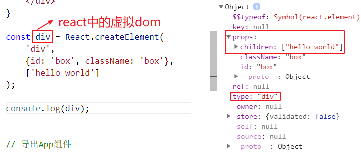

### react

### 概念：一个声明式，高效且灵活的用于构建用户界面的 JavaScript 库

### react的特性：虚拟dom、单向数据流、组件化

### 遵顼语法：jsx语法   jsx->js和html的混合体


js的渲染速度比html渲染的快，操作虚拟dom比真实dom方便

# react简介


1. react由facebook公司推出，因为该公司不满足于市面上现有的前端框架，他们认为`MVC`只会让前端越来越复杂，因此react就诞生了，react只关注与视图层，官方对react的定位是：一个快速构建前端视图的javaScript库。

2. 虚拟dom是一个用于表示真实dom节点的javaScript对象。

假设有一个html标签如下：

```html
<div id="box" class="box">hello world</div>
```

那么其真实dom的表示方法为

```js
var oBox = document.getElementById('box');
//  oBox就是真实dom节点，其本质也是一个对象，只是该对象有很多的属性，操作起来是昂贵的。
```

其虚拟dom的表示方法为

```js
var vBox = {
    tagName: 'div',
    props: {
        id: 'box',
        class: 'box'
    },
    children: ['hello world']
}
// vBox其实就是虚拟dom，是我们用原生的Object对象去描述一个真实dom节点的方式，该对象只有标签的一些关键属性。
```

3. 封装一个可以生成虚拟dom的方法，可参考如下写法

```js
// 生成虚拟dom
function createVdom(tagName, props, children){
    const VDom = {
        tagName,
        props,
        children
    }
    return VDom;
}

```

## 封装一个转换虚拟dom为真实dom的方法，课参考如下：

```js
 // 生成虚拟dom
function createVdom(tagName, props, children){
    const VDom = {
        tagName,
        props,
        children
    }
    return VDom;
}


// 把虚拟dom转换成真实dom

 function creatRdom(vDom){
    const { tagName, props, children } = vDom;
    // 创建出真实dom节点
    const rDom = document.createElement(tagName);
    // 给节点添加属性
    if(props){
        Object.keys(props).forEach(item => {
            rDom.setAttribute(item, props[item]);
        })
    }
    // 遍历children
    children.forEach(item => {
        if(typeof item === 'string'){
            const text = document.createTextNode(item);
            rDom.appendChild(text);
        }else{
            rDom.appendChild(creatRdom(item))
        }
    });
    return rDom;
 }
```

5. 安装yarn https://classic.yarnpkg.com/zh-Hans/docs/install#windows-stable
6. 使用create-react-app搭建react开发环境，并查看react中如何表示虚拟dom。react中表示虚拟dom的形式如下：



6. `React.createElement`的书写方式太复杂所以引入`jsx`语法，`jsx`语法可以很好的表示虚拟dom，但是`jsx`毕竟不是合法的js语言，所以jsx语法最后都会被`babel`转换成合法js语法。


7. react中引入静态资源（css、图片），其实是webpack使用对应的loader加载了资源，并进行了打包。

8. `jsx`的语法规则为遇到`<>`则以虚拟dom的方式解析，遇到`{`则以`js`的方式解析。其中`{}`中应该出现标准`js`的语法(有值的表达式)，其中的值可以是 数字、字符串、null、布尔、undefined 或者react元素（虚拟dom），如果是数组的话，则会自动的把数组中的元素展开。

9. `React.createElement`这个方法的三个参数

```js
React.createElement(param1,param2,param3)
param1 string | React组件
param2 Object 组件上的属性
param3 Array 组件的子元素
```

10. `ReactDOM.render`这个方法的三个参数

```js
ReactDOM.render(param1, param2, param3)
param1 Object 组件
param2 Dom 要挂载的dom节点，目标dom，不一定是根dom，根dom是root
param3 Function 真实dom结构渲染成功后的回调函数
```

### 授课思路


## 虚拟dom 

  1.什么是虚拟dom ? ==> 用json对象描述的dom对象
  2.什么是json对象? 数组对象 或 object对象
在React中更新浏览器DOM需要三步: 1. 每次数据模型变化的时候，虚拟DOM节点树都会重新构建。 2. React依赖某个算法(称之为diff算法)来与上一个虚拟DOM节点数进行比较，只有在不同的情况下才重新进行计算。 3.所有的变化要经过批处理，完成之后，真实DOM才进行更新。


### create-react-app 是什么?

是facebook的react团队出的一个构建react单页面应用的脚手架工具  
它集成了webpack、配置了一系列loader和默认的npm脚本 npm版本必须大于5.2
意义:快速的实现零配置 ==》 快速开发react应用
优点:用于搭建react项目,省略了很多涉及到配置的地方,上手简单

下载create-react-app 
 npm i create-react-app -g  ==> 只用下载一次！！！

如果不下载create-react-app  使用npx

### 如何用create-react-app创建项目? 

 1.create-react-app 项目名(纯小写或中划线) 

 2.不全局下载create-react-app的情况下 依然可以创建react项目
 npx create-react-app 项目名

 会临时安装create-react-app包,命令完成后,临时安装的create-react-app包会被删掉,不会出现在全局,下次再执行下载命令时,还是重新临时安装

或者是 create-react-app 项目名

### 3.如何启动react项目? 

yarn start / npm (run) start


打包项目的命令是  npm run build

### 4.项目生成之后将不必要文件删除,最终文件列表如下

create-react-app  , npm的版本必须大于5.2
如果不下载create-react-app, 使用npx
npx create-react-app demo  (项目名，纯小写，或中划线)，不能写驼峰
先是 cd demo,然后yarn start  或者 npm run start
打包项目，npm run build
index.js是入口文件
react-dom是把虚拟dom生成实体dom，生成的实体dom通过render方法渲染


vue 和 react 构建单页面应用 spa  mpa  （笔记本）

全局下载，只用下载一次，
yarn build 生产模式打包，为生产模式打包静态文件
在src里面写代码，index.js是入口文件，App.js是组件，
在src里面新建page文件夹，用来存放页面，是一个js文件，
在这个js文件里
先引入  react
import React from 'react'

<!-- 引入react-dom，作用： 把虚拟dom转换成真实dom --> 没用了，用不着

引入css和图片，通过import，也在这个js文件里面，如果这个div里面用到了css和图片


# 第二单元(react的组件-state-props-setState)


### 课程目标

1. 组件的基本介绍
2. 理解组件和组件的创建、以及能够根据实际场景去划分合理的组件。
3. 理解并且能够灵活的应用组件中的state、props。
4. 可以使用组件去实现各种前端交互。

### 知识点

1. 组件介绍
   + 1.组件是React中最基本的内容，使用React就是在使用组件
   + 2.组件表示页面中的部分功能
   + 3.多个组件可以实现完整的页面功能
   + 4.组件特点：可复用，独立，可组合 
2. 组件的定义：组件能够表示一块视图的结构表现以及逻辑交互，并且可以重复利用。
3. 如何创建组件（2种方式）

```js
// 函数是组件
// 没有状态，只有属性
function ComponentName(props){
    return 虚拟dom
}

// 类组件
// 有状态也有属性
class ComponentName extends React.Component{
    static defaultProps = {
        // 默认属性
    }
    state = {
        // 状态
    }
    render(){
        return 虚拟dom
    }
}
```

3. 组件中的状态（state）是和组件的视图对应的，状态决定了视图的呈现，每个组件都有自己独立的状态。组件的内部的状态是可以随意改变的，状态的改变意味着视图的呈现也发生了变化。

4. 组件中的属性（props）是来在组件调用的时候，从外部传入组件内部的。在组件内部属性是不能被改变的。属性的数据在一定程度上也决定了视图的呈现。

5. 想要改变组件内部的状态，从而让视图也跟着更新需要执行`this.setState`方法

6. 理解`this.setState`这个方法的原理，该方法接收两个参数：

   

```js
this.setState(对象，回调函数)

// 该方法的作用是修改state中的数据，并且让视图更新为和state一致的视图。
// 该方法会把第一个参数接受的对象，和组件的state这个对象进行合并，然后在根据合并后的新对象，去更新视图
// 视图是的更新是异步，所以回调函数的作用就是等待视图更新成功后，才去执行。
```

7. 使用props传参的写法，例子如下：

```jsx
// 父组件 Parent
class Parent extends React.Component{
    state = {
        title: 'hello world'
    }
    render(){
        return <div>
                    <Child title={this.state.title} />
                </div>
    }
}

// 子组件  Child
class Child extends React.Component{
    render(){
        return <div>
                    <h1>{this.props.title}</h1>
                </div>
    }
}

// 该例子演示了，props的用法，可以通过父组件给子组件传递参数。
```

8. 可以给一个组件设置默认属性，代码如下：

```jsx
class HelloWorld extends Component{
    static defaultProps = {
        // 在这里可以设置默认属性
        text: 'hello world'
    }
    render(){
        return <div>
                {this.props.text} 
            </div>
    }
}
```

### 授课思路


# react组件的生命周期(看react面试)


# react 绑定 dom 与 vue 绑定dom 做对比


# 四单元(ref与DOM-findDomNode-unmountComponentAtNode)


### 课程目标

1. 理解react的框架使用中，真实dom存在的意义。

2. 使用真实dom和使用虚拟dom的场景。

3. 灵活掌握并能够合理使用操作真实dom的方法。

### 知识点

1. react中提供了ref这个属性来获取原生的dom节点，使用方式：在虚拟dom中添加ref属性，即可在组件实例的refs属性中获取该真实dom节点。由于组件实例化的时候，真实dom节点是在最后才生成的。所以，我们获取真实dom节点应该是在componentDidMount这个生命周期中。

```js
class HelloWorld extends Component{
    render(){
        return <div>
            <h1 ref="h">hello world</h1>
        </div>
    }
    componentDidMount(){
        console.log(this.refs.h); // 打印的是h1这个dom节点。
    }

}
```

2. ref也可以使用在组件标签上使用，此时获取的是该组件标签的组件实例。如下：

```js
class Button extends Component{
    render(){
        return <button>确定</button>
    }
}

let btn = React.createElement()
props.ref function

props.ref(btn)

class HelloWrold extends Component{
    getBtnThis = btn => {
        console.log(btn)  // Button组件的第二个组件实例
    }
    render(){
        return <div>
            <Button ref="btn"></Button>
            /**
             let btn = new Button()
             btn.ref === typeof function
             btn.ref(btn)

             typeof string
             hellowrold.refs.btn = btn
             * /
            <Button ref={(btn)=>{console.log(btn)}}></Button>
        </div>
    }
    componentDidMount(){
        console.log(this.refs.btn); // Button组件的第一个组件实例
    }
}
```

3. `findDomNode`这个方法可以根据组件实例（每个组件实例都对应的有一段dom节点获取该组）件实例所对应的真实dom节点。该方法的使用如下

```js
/**
    context 一个组件的组件实例
    dom 该组件实例所对应的真实dom节点。
*/
const dom = React.findDomNode(context);
```

5. `unmountComponentAtNode`该方法的作用是：从 DOM 中移除已经挂载的 React 组件，清除相应的事件处理器和 state。如果在 container 内没有组件挂载，这个函数将什么都不做。如果组件成功移除，则返回 true；如果没有组件被移除1，则返回 false。

```js      
const result = React.unmountComponentAtNode(DOMElement container)
```

6. 掌握在什么情况下需要真实的dom节点；react的虚拟dom不能实现的原生dom的api的情况，比如：文本框自动聚焦，音频视频相关的api，获取元素的宽高和位置等。基本原则是：能不用真实dom节点尽量不用，实在不能用虚拟dom的时候，才使用真实dom节点。再一种情况是，现有的一些库是针对dom操作而构建的，那么想要把这些库和react结合在一起，就必须要使用真实dom节点，比如`swiper betterScroll echarts`等等。

### 授课思路

.png)

### 


# 第五单元(事件系统-原生事件-react中的合成事件-详解事件的冒泡和捕获机制)


### 课程目标

1. 深入理解和掌握事件的冒泡及捕获机制
2. 理解react中的合成事件的本质
3. 在react组件中合理的使用原生事件

### 知识点

1. 在原生的dom模型上触发的事件会进行事件传递。而所谓的事件传递指的是当在A元素上触发某一事件的时候，B元素如果满足了和A元素一定的关系的话，那么B元素上也可能触发该事件（即使B元素未添加该事件）；

2. dom模型是怎样的呢？如何一组dom元素可以看成一个是一个家族的族谱，那么我们就可以把dom元素之间的关系描述成直系和旁系，如果事件要进行传递的话，dom元素之间必须先满足直系的关系。且是在直系关系中，真正触发的元素的上层的元素才有可能被传递。如下：

```html
<div>
    <h1>hello world</h1>
    <ul>
        <li>1</li>
        <li>2</li>
        <li>3</li>
        <li>4</li>
    </ul>
    <div>foot</div>
</div>
```

假如我们用鼠标点击了 `<ul><ul/>`这个元素的话，那么哪些元素可能也会触发点击事件呢？那么我们可以这样分析：

    - 该元素的直系是这样的  `div > ul > li(4个)`
    - 直系中的上层元素是 `div` 那么只有div才有可能触发点击事件。

那么，如果点击了 `<li>1</li>`这个元素呢？

3. 假如点击了 `<li>1</li>`这个元素的话，根据分析可以知道将要触发事件的元素是  `ul`和`div`,那么它俩谁先触发呢？这就要涉及到捕获和冒泡的问题了！ 

   - 首先，捕获和冒泡决定的是事件传递的顺序，
   - 所有元素的事件默认都是冒泡的，但是在添加事件的时候，可以改变这种特质比如使用 `addEventListener`这个方法。
   - 那么冒泡的事件是从内向外传递的，捕获是从外向内传递的。
   - 捕获的事件的优先级要大于冒泡的优先级

根据以上的总结，那么点击了`<li>1</li>`这个元素的话，哪些元素会触发事件，且顺序是怎样的？
`div`和`ul`会触发事件，顺序是先`ul`然后是`div`

4. 如果某个事件的事件对象阻止了事件传递（ev.stopPropagation()），那么后续的事件就不会再触发了。

5. 所有元素的顶层元素是  `document`;

6. react中的合成事件就是利用了事件传递的这种特性（事件冒泡），所有的元素事件触发，肯定会传递到document身上，react中为了节省性能，我们写在虚拟dom中的事件，其实在编译的时候，都被挂载到了document这个元素上，只是react自己实现了一套事件系统，可以记录真正触发的元素是那个，以及其他相关的信息。在 React 17 中，事件委托不再挂在 document 上，而是挂在 DOM 容器上，也就是 ReactDom.Render 所调用的节点上。如果同一个dom同时绑定了合成事件和原生事件，原生事件先被触发。如果react的原生事件阻止了事件冒泡，那么合成事件就不会被触发

7. 函数的this指向，应该记住如下几点：

   - 函数在调用的时候才能去判断this的指向
   - 函数在调用的时候，我们要判断函数当前是在什么环境下调用的，此时函数指向该环境，比如：

   ```js
       function add(){
           console.log(this)
       }
   
       cosnt obj = {add: add}
   
       window.add() 
       obj.add() 
   
   ```

   - 函数的this在函数调用如下方法的时候可以被改变: bind call apply

   - 以new的方式调用函数的时候，函数的this也会被改变   `new 函数名()`
     let Fn = new fn()
     
     


## react中事件的this指向

react中事件的this指向，我们希望this的指向尽可能的指向组件实例。如下：


```js
class Test extends Component {
    constructor() {
        super(arguments);
        this.handleClick2 = this.handleClick2.bind(this);
    }
    handleClick(){
        console.log(this);
        return 'hello world';
    }
    handleClick1 = () => {
        console.log(this);
        return '123';
    }
    handleClick2(){
        console.log(this)
        return '456';
    }
    render() {
        <div>
            <h1>{this.handleClick}</h1>
            <button className="button" onClick={this.onReactClick}>点击</button>
            <button className="button" onClick={() => this.onReactClick()}>点击</button>
            <button className="button" onClick={this.handleClick1}>点击</button>
            <button className="button" onClick={this.handleClick2}>点击</button>
        </div>
    }
}
```

理解上述this的指向以及原理即可，记住一点：当事件触发的时候，对应的事件监听器会触发，要认清楚谁才是事件监听器，而且事件监听器的this指向谁。

### 绑定this 的方法


```jsx

import React, { Component } from 'react'

export default class App extends Component {


  click = () => {
    console.log(this); // App 组件实例
  }

  click1(a) {
    console.log(this); 
    console.log(a);
  }


  render() {
    return (
      <div>
        <button onClick = {this.click}> 123 </button>
        <button onClick = {this.click1}> 123 </button>  // undefined
        <button onClick = {this.click1.bind(this, 4)}> 123 </button> // 组件实例
        <button onClick = {() => {this.click1()  }}> 123 </button> // App组件实例
      </div>
    )
  }
}
```


# 高阶组件


##### 1首先回顾一下什么是高阶函数

高阶函数是一个函数，它接收函数作为参数或将函数作为输出返回。

```js
function a( functionName ){
    functionName()
}

function b(){
    console.log('b')
}

 a(b)

map  filter every some forEach 

// a为一个高阶函数
```

##### 2 高阶组件

高阶组件是一个组件(函数)，它接收组件作为参数，并将组件作为输出返回

```js
class Small extends Component{
  render(){
    return <h1>{this.props.text}</h1>
  }
}

//高阶组件 ==> 工厂模式
function High(Group){

  return class Height extends Component{
    render(){
      
      return <div>
              <Group {...this.props}/>
            </div>
    }
  }
  return Height
}
//此时的small 经过进化已经不是原来的Small组件了
Small = High(Small);

class App extends Component{
  state={
    text:'高阶组件'
  }
  render(){
    return <div>
      <Small text={text}/>
    </div>
  }
}

```


# React.children


在组件传值时，不光可以传递变量，函数，也可以传递标签,通常我们使用两种方式传递标签:
1 通过属性传递标签,子组件接收时使用this.props

```jsx
class Text extends Component{
  render(){
    return <div>{this.props.hHtml}</div>
  }
}

class App extends Component{
  render(){
    return <div>
        <Text hHtml={<h1>helloworld</h1>}/>
    </div>
  }
}
```
2 将组件写成双标签，包住要传递的标签,子组件接收时使用this.props.children

```jsx
class Text extends Component{
  render(){
    return <div>{this.props.children}</div>
  }
}

class App extends Component{
  render(){
    return <div>
        <Text>
            <h1>helloworld</h1>
        </Text>
    </div>
  }
}
```


# propTypes验证


### 课程目标

1. 理解类型验证的必要性

2. 灵活掌握类型验证的使用


### 知识点

1. 在给react组件传属性的的时候，我们可以定义属性的类型，此时我们需要下载`prop-types`这个库。

安装`prop-types`

```js
npm install prop-types -S
```

引入和使用

```js
import PropTypes from 'prop-types';

class Hello extends Component{
    static propTypes = {
        title: PropTypes.string.isRequired,
    }


// title属性的值必须是字符串且必传
```

基本的使用格式如下： 


2. 基本的类型验证如下

   - PropTypes.array 类型应为数组
   - PropTypes.bool  类型应为布尔
   - PropTypes.func   类型应为函数
   - PropTypes.number 类型应为数字
   - PropTypes.object 类型应为对象
   - PropTypes.string  类型应为字符串
   - PropTypes.element 验证属性为React元素
   - PropTypes.node   类型为React可以渲染的任何东西，数字，字符串，元素等等
   - PropTypes.any  任何类型都可以

3. 还有一些辅助方法

   - **instanceOf**
     使用形式如下：
     ```PropTypes.instanceOf(Array).isRequired```
     这个方法表示验证类型必须是某个类的实例，上述代码表示传入的参数必须是Array的实例；一般这个方法会接收一个类；

     ```js
       let arr = [1,2,3]
       let arr = new Array(1,2,3)
     
       let num = Number(1)
     
     ```
     

	

  		arr instanceof Array
  	    num instanceof Number


        arr instanceof Object
        num instanceof Object 


​      
​      


```
String 
Object
Array
Boolean
Number
- **oneOf**
使用形式如下：
​```PropTypes.oneOf([‘news’,’photos’])```
这个方法用来规定传入的属性必须是给定值中的一个，上述代码表示传入的值只能是’news’或者’photos’,一般该方法接收一个数组，数组的元素则为供选择的值

- **oneOfType**
使用形式如下
​```js
PropTypes.oneOfType([
    PropTypes.string,
    PropTypes.number,
    PropTypes.instanceOf(Array)
])
​```
这个方法表示传入的参数可以使多种类型中的一个，上述代码表示传入的参数可以是字符串，数字或者一个Array的实例；一般该方法接收一个数组，数组的元素是规定传入参数的类型的；
```


    - **arrayOf**
    用法如下：
    ```PropTypes.arrayOf(PropTypes.string)```
    该方法表示传入的参数必须是某个类型的数组，上述代码表示传入的必须是一个字符串类型的数组，一般该方法接收一个验证类型；
    
    - **objectOf**
    用法如下
    ```PropTypes.objectOf(PropTypes.string)```
    该方法表示传入的参数必须是某个类型的对象，上述代码表示传入的必须是一个字符串类型的对象，一般该方法接收一个验证类型；
    
    - **shape** 
    用法如下：
    ```js
    PropTypes.shape({
        color:PropTypes.string
        fontSize:PropTypes.number
    })
    ```
    该方法规定传入的参数应该是一个特定的对象，上述代码表示传入的参数必须是对象，且应该有color属性其值是字符串，也应该有fontSize属性其值是数字；该方法接收一个对象，对象的属性值为验证类型；
    
    **前边提到的所有的类型都可以在最后添加isRequired标签，表示该属性必须存在；**

4. 自定义验证类型

当然React给我们预留了自己验证的方法，使用起来会更加的灵活；我么可以为要验证的属性添加一个函数，该函数会在验证的时候自动执行，并且接受几个参数；

```js
propTypes:{
	msg:function(props,propName,componentName){
		if(!/matchme/.test(props[propName])){
			return new Error(`${componentName}内的${propName}类型不正确`)
        }
    }
}
```

通过上述代码我们可以得知：该自定义的验证函数可以接收三个参数分别是：组件的属性(this.props)、当前正在验证的属性名、组件的名称；在函数内部我们可以书写验证逻辑，如果验证不通过，就返回一个Error类型的错误；


### 

# 第十单元(children的深入用法-React.Children对象上的方法)

### 课程目标

1. 理解什么是children
2. 掌握React.Children对象上的方法

### 知识点

1. 什么是children


上图中我们看到了，我们之前学过的React.createElement方法，现在大家发现jsx的内容，全部都体现在了该方法上；那么React.createElement其实是有三个参数的，第三个参数被称之为children，也就是子元素；看下图：  
  React.createElement('标签名/组件',组件属性,子元素...)
这个时候，第三个参数也体现出来了；
那么我们可以发现children其实也是外部传递的数据，只不过传递的是react元素。那么我们在组件的内部应该用this.props.children去接收这些元素；
在组件的内部：

``` js
console.log(this.props.children) => [<span>哈哈哈</span>]
```

2. React.Children对象上的方法

我们已经知道在组件的内部如何获取到children了，那么针对children的处理，我们需要特别的注意，因为来自外界的children可以能是0个，也可能是1个，也可能是很多个；我们处理起来是比较麻烦的，但是React给我们提供了一些可以来处理children的方法；这些方法都挂在了`React.Children`这个对象上:

> map 方法

```js
React.Children.map
```

该方法用来遍历children,使用方法如下:

```js
React.Children.map(this.props.children,(item,key)=>{  //… });
```

该方法会把children看做一个数组，进行遍历，item表示数组中的每个元素，key表示每个元素对应的索引；每个回调函数的返回值会被组合成为一个数组变成map方法的返回值;

> forEach 方法

```js
React.Children.forEach
```

该方法也是来遍历children的，用法如下：

```js
React.Children.forEach (this.props.children,(item,key)=>{  //… });
```

该方法类似于map，但是没有返回值

> count 方法

该方法用来返回children中所包含组件的数量，用法如下：

```js
React.Children.count(this.props.children)
```

> only

该方法用来返回组件唯一的children，如果children不唯一将不允许调用该方法;


# 第十一单元(受控组件和非受控组件)

### 课程目标

1. 理解因为react的单向数据流
2. 理解表单组件会因为react数据流变的不好维护
3. 理解受控组件与非受控组件的实质区别
4. 理解受控组件在实际项目中的运用场景
5. 利用受控组件完成一个表单控件的封装

### 知识点

1. react单向数据流

- 数据主要从父节点传递到子节点(通过props)如果顶层（父级）的某个props改变了，React会重渲染所有的子节点,如果某个组件中的state中某个数据改变了,则当前组件也会被重新渲染（调用render）

- props => 不可以使用this.props直接修改props，因为props是只读的，props是用于整个组件树中传递数据和配置。

- state => 每个组件都有属于自己的state，state和props的区别在于前者(state)只存在于组件内部，只能从当前组件调用this.setState修改state值(不可以直接修改this.state！)。


2. 表单元素

- 表单元素有其特殊之处，用户可以通过键盘输入与鼠标选择，改变界面的显示。界面的改变也意味着有一些数据被改动，比较明显的是input的value，textarea的innerHTML，radio/checkbox的checked。

3. 非受控组件

   3-1. 如果一个表单组件没有value props(单选按钮和复选按钮对应的是 checked props)时,就可以称为非受控组件;

   3-2.使用defaultValue和defaultChecked来表示组件的默认状态;

   3-3.通过 defaultValue和defaultChecked来设置组件的默认值,它仅会被渲染一次,在后续的渲染时并不起作用

```js
import React, { Component } from 'react';

class UnControlledInput extends Component {
    handleSubmit = (e) => {
        console.log(e);
        e.preventDefault();
        console.log(this.name.value);
    }
    render() {
        return (
            <form onSubmit={this.handleSubmit}>
                <input type="text" ref={i => this.name = i} defaultValue="BeiJing" />
                <button type="submit">Submit</button>
            </form>
        );
    }
}

export default UnControlledInput;
```

4. 受控组件

- 从React的思路来讲，肯定是想让数据控制一切，或者简单的理解为，页面的生成与更新得忠实地执行JSX的指令，如果说：

```
<input value={this.state.value} />
```

- 当input.value是由组件的state.value拍出来的，当用户进行输入修改后，然后JSX再次重刷视图，这时input.value是采取用户的新值还是state的值？基于这个分歧，React给出一个折衷的方案，两者都支持，于是就产生了今天的受控组件了。
- React认为value/checked不能单独存在，需要与onInput/onChange/disabed/readOnly等控制value/checked的属性或事件一起使用。 它们共同构成受控组件，受控是受JSX的控制。如果用户没有写这些额外的属性与事件，那么框架内部会给它添加一些事件，如onClick, onInput, onChange，阻止你进行输入或选择，让你无法修改它的值。

```jsx
  /*
  受控组件
  1. React是一个单向数据流
  2. 但可以自定义双向数据流组件(受控组件)
  */
  /*
  功能: 自定义组件, 功能如下
    1. 界面如页面所示
    2. 初始数据显示为renyl
    3. 输入数据时, 下面的数据同步变化
  */
  class ControlInput extends React.Component{
      constructor(props){
          super(props);
          this.state = {
              msg:'renyl'
          }
          this.handleChange = this.handleChange.bind(this);
      }
      // 通过事件的形式控制存储状态
      handleChange(event){
          debugger;
          console.log(event.target.value);
          this.setState({
            msg:event.target.value
          });
      }
      render () {
          let {msg} = this.state;
          return (
                <div>
                  <input onChange={this.handleChange} type="text" value={msg}/>
                  <p>{msg}</p>
                </div>
          )
      }
  }
  ReactDOM.render(<ControlInput />,document.getElementById("example"));

```

5. 受控组件的总结

   5-1.可以通过初始state中设置表单的默认值;

   5-2.每当表单的值发生变化时,调用onChange事件处理器;

   5-3.事件处理器通过合成事件对象e拿到改变后的状态,并更新应用的state.

   5-4.setState触发视图的重新渲染,完成表单组件值得更新


# 第十二单元(react路由-使用react-router-dom-认识相关的组件以及组件属性)

 Single Page Application

## 原理

路由原理：https://blog.csdn.net/weixin_34377919/article/details/88069239

### 课程目标

1. 理解路由的原理及应运
2. 理解react-router-dom以及内置的一些组件
3. 合理应用内置组件及其属性搭建项目路由

### 知识点

1. 路由的由来

- 路由就是指随着浏览器地址栏的变化，展示给用户的页面也不相同。这是从路由的用途上来解释路由是什么的，还有一种说法是：路由就是URL到函数的映射。

  1-1. hash[hæʃ] => 路由的实现就是基于location.hash来实现的。其实现原理也很简单，location.hash的值就是URL中#后面的内容

  ```html
  <a href="#/">主页</a>
  <a href="#/home">home</a>
  <a href="#/index">index</a>
  
  <div id='content'></div>
  <script>
  /*
   URL中hash值只是客户端的一种状态，也就是说当向服务器端发出请求时，hash部分不会被发送。hash值的改变，都会在浏览器的访问历史中增加一个记录。因此我们能通过浏览器的回退、前进按钮控制hash的切换。我们可以使用hashchange事件来监听hash的变化。
   */
      class Router{
          constructor({routes}) {
              this.routes = routes; //将接收到的参数赋值在当前类中
              this.everyPath = {}; //定义空对象
              this.init(); //初始化
              this.routes.forEach(item => {
                  this.everyPath[item.path] = function() {
                      document.getElementById('content').innerHTML = item.component;
                  }
              })
          }   
          //初始化方法
          init() {
              //页面加载完毕之后 调用updateLocation方法
              window.addEventListener('load', this.updateLocation)
              window.addEventListener('hashchange', this.updateLocation)
          }
          updateLocation = ()=>{
              {
                  '/': () => {},
                  '#/home': () => {},
                  
              }
              //location.hash是指#后的部分 ==> 通过location.hash属性获取或设置hash值
              //截取#后的内容 ==> my
              let pathRes = window.location.hash.slice(1);
              //console.log(this.everyPath, '----', pathRes)
              this.everyPath[pathRes]();
          }
      }
      new Router({
          routes: [
              {
                  path: '/',
                  component: '主页'
              },
              {
                  path: '/home',
                  component: 'home'
              },
              {
                  path: '/index',
                  component: 'index'
              }
          ]
      })
  </script>
  ```

  1-2. history => 前面的hash虽然也很不错，但使用时都需要加上#，并不是很美观。因此到了HTML5，又提供了History API来实现URL的变化。
  其中做最主要的API有以下两个：history.pushState()和history.repalceState()。这两个API可以在不进行刷新的情况下，操作浏览器的历史纪录。
  唯一不同的是，前者是新增一个历史记录，后者是直接替换当前的历史记录。

  ```html
  <a href="javascript:;" data-to='/'>去首页</a>
  <a href="javascript:;" data-to='/home'>去home页</a>
  <a href="javascript:;" data-to='/index'>去index页</a>
  <div id="content"></div>
  <script>
      class Router{
          constructor({routes}) {
             this.router = routes;
             this.init()
             this.bindClick();
          }
          //初始化方法
          init() {
              //popstate监听
              window.addEventListener('popstate', this.updateView);
          }
          updateView = ()=>{
              //获取content元素
              let content = document.getElementById('content');
              //location.pathname 获取url域名(域名ip)后的部分
              let clickRes = window.location.pathname 
              //遍历传递过来的数据
              content.innerHTML = this.router.filter(val => val.path === clickRes)[0].component;
          }
          bindClick() {
              //获取页面中的所有a标签
              let pushA = document.querySelectorAll('a');
              [].forEach.call(pushA, item => {
                  item.addEventListener('click', () => {
                      //clickRes ==> a标签上的data-to属性 ==> 要访问的地址
                      let clickRes = item.getAttribute('data-to');
                      //history.pushState ==> 在历史记录中增加一条记录 ==> 不刷新浏览器 
                      //创建新的浏览记录并查无浏览记录队列中
                      //history.pushState(object,title,url)
                      //object:是一个js对象,通过pushState方法可以讲stateobject内容传递到页面中
                      //title:很少有浏览器支持该参数,一般默认传递空或空字符串
                      //url:新的历史记录的地址
                      window.history.pushState({}, null, clickRes)
                      this.updateView()
                  })
              })
          }
      }
      new Router({
          routes: [
              {
                  path: '/',
                  component: '主页'
              },
              {
                  path: '/home',
                  component: 'home'
              },
              {
                  path: '/index',
                  component: 'index'
              }
          ]
      })
      // 1.状态对象（state object）：一个JavaScript对象，与用pushState()方法创建的新历史记录条目关联。无论何时用户导航到新创建的状态，
      //会触发popstate事件，并能在事件中使用该对象。
      // 2.标题（title）：一般浏览器会忽略，最好传入null。
      // 3. 地址（URL）：就是需要新增的历史记录的地址，浏览器不会去直接加载改地址，但后面也可能会去尝试加载该地址。此外需要注意的是，
      //传入的URL与当前URL应该是同源的。
  </script>
  
  ```

  1-3. 两种实现方式的对比：基于Hash的路由实现，兼容性更好；而基于History API的路由，则更正式，更美观，可以设置与当前URL同源的任意URL，路径更直观。
  此外，基于Hash的路由不需要对服务器做改动，基于History API的路由需要对服务器做一些改造，需要对不同的路由进行相应的处理才行（404）。

2. 相应的内置组件

   2-1. BrowserRouter

   - basename: 该router下路由路径的base url. 应该有一个前置斜杠，但不能有后置斜杠。如果你的页面路由路径为某个子目录，那base url应设置为这个子目录。
     该页面的其他路由路径即在这个之下。


    ```js
            <BrowserRouter basename="/calendar"/>
            <Link to="/today"/> // renders <a href="/calendar/today">
    ```
    
    2-2. HashRouter
    
    - 与BrowserRouter一致
    
    2-3. Link
    
    - to: string, 路由链接， 由location的path, search, hash属性拼接而成。
    
    - to : object { pathname: 跳转路径，search: 查询参数， hash: url中的hash, eg. #a-hash, state:存储到location中的额外状态数据}
    
    - replace: 布尔值- 为true时，将会替换history stack中的当前路径
    
    2-4. NavLink
    
    - activeClassName: string, 渲染样式
    
    - activeStyle:object, 渲染样式
    
    2-5. Redirect
    
    - to: string, url地址
    
    - to: object, location object, 属性有：pathname: 跳转路径，search: 查询参数， hash: url中的hash, eg. #a-hash, state:存储到location中的额外状态数据. 
        location中的state可以在redirect跳转组件的this.props.location.state访问
    - push: 为true表示redirect path将往history stack中推一条新数据而不是替换他
     
    - from: redirect from url, 会进行正则匹配。只能用在<Switch>中
    2-6. Route
    
    - component: 当传递component渲染UI时，router将会用React.createElement来将组件封装成一个新的React element, 当传递一个inline func, 
    react每次render都会unmount, mount一个新的组件，会消耗性能，此时可以使用render/children prop
    
    - render: func, inline func不会有上述性能问题，参数同route props相同
    
    2-7. Switch
    
    - 渲染<Route>或<Redirect>中第一个匹配location的组件，且子元素只能为<Route>或<Redirect>


# react路由-react路由的跳转以及路由信息

## 什么是前端路由

简单的说，就是在保证只有一个 HTML 页面，且与用户交互时不刷新和跳转页面的同时，为 SPA 中的每个视图展示形式匹配一个特殊的 url。在刷新、前进、后退和SEO时均通过这个特殊的 url 来实现。

为实现这一目标，我们需要做到以下二点：

1. 改变 url 且不让浏览器像服务器发送请求。
2. 可以监听到 url 的变化

接下来要介绍的 hash 模式和 history 模式，就是实现了上面的功能


## 路由模式

### hash

hash值的改变不会引起页面的刷新

这里的 hash 就是指 url 后的 # 号以及后面的字符。比如说 "[www.baidu.com/#hashhash](http://www.baidu.com/#hashhash)" ，其中 "#hashhash" 就是我们期望的 hash 值。

由于 hash 值的变化不会导致浏览器像服务器发送请求，而且 hash 的改变会触发 hashchange 事件，浏览器的前进后退也能对其进行控制，所以在 H5 的 history 模式出现之前，基本都是使用 hash 模式来实现前端路由。


#### 使用到的API

+ window.location.hash

+ 监听的事件

  + hashchange

  ```js
  window.location.hash = 'hash字符串'; // 用于设置 hash 值
  
  let hash = window.location.hash; // 获取当前 hash 值
  
  // 监听hash变化，点击浏览器的前进后退会触发
  window.addEventListener('hashchange', function(event){ 
      let newURL = event.newURL; // hash 改变后的新 url
      let oldURL = event.oldURL; // hash 改变前的旧 url
  },false)
  ```

  

### history

在 HTML5 之前，浏览器就已经有了 history 对象。但在早期的 history 中只能用于多页面的跳转：

```
history.go(-1);       // 后退一页
history.go(2);        // 前进两页
history.forward();     // 前进一页
history.back();      // 后退一页
复制代码
```

在 HTML5 的规范中，history 新增了以下几个 API：

```
// 这两个方法都是监听三个参数
history.pushState();         // 添加新的状态到历史状态栈
history.replaceState();      // 用新的状态代替当前状态
history.state                // 返回当前状态对象
//popstate监听, popstate 不知道是不是新增的，用来监听state的变化
window.addEventListener('popstate', this.updateView);
```

其中做最主要的API有以下两个：history.pushState()和history.repalceState()。这两个API可以在不进行刷新的情况下，操作浏览器的历史纪录。
唯一不同的是，前者是新增一个历史记录，后者是直接替换当前的历史记录。


### 知识点

1. 路由的配置属性

- 路由配置属性主要有 path、name、component 等。
  path：组件相对路径
  name：组件路径别名
  component：组件地址
  在路由配置中，有两个属性 exact 和 strict 表示路径匹配。
  “/detail” exact 属性为 true 时匹配的路由有:"/detail/"，
  但是 url 中有 “/detail/” 匹配不到。
  “/detail” strict 属性为 true 时匹配的路由有:"/detail"，
  但是 “/detail/” 可以被匹配到。
  综上所述，要想严格匹配，就需要将 exact 和 strict 都设为 true

2. 路由的跳转形式

- Link 或者 NavLink形式，实质是个 a 标签。区别是后者可以切换时改变样式，用法如下：

```jsx
<ul>
  <li><NavLink exact to="/" activeStyle={{
           fontWeight: 'bold',
           color: 'red'
         }}>home</NavLink>
  </li>
  <li><NavLink exact to="/detail" activeStyle={{
          fontWeight: 'bold',
          color: 'red'
         }}>detail</NavLink>
  </li>
</ul>

```

- 使用点击事件，用法如下：

```jsx
<ul>
  <li onClick={() => this.props.history.push({pathname:'detail'})}><div>home</div>
  </li>
  <li onClick={() => this.props.history.push({pathname:'home'})}><div>detail</div>
  </li>
</ul>

```

3. 跳转传参

- 直接Link属性传递

```jsx
<ul>
  <li><NavLink exact to="/" activeStyle={{
           fontWeight: 'bold',
           color: 'red'
         }}>home</NavLink>
  </li>
  <li><NavLink exact to={{pathname:'detail',state:{id:2}}} activeStyle={{
          fontWeight: 'bold',
          color: 'red'
         }}>detail</NavLink>
  </li>
</ul>

```

- 事件跳转传参

```jsx
<ul>
  <li onClick={() => this.props.history.push({pathname:'detail',state:{id:1}})}><div>home</div>
  </li>
  <li onClick={() => this.props.history.push({pathname:'home',state:{
  id:0}})}><div>detail</div>
  </li>
</ul>

// 获取参数
this.props.history.location.state

```

4. 传递的参数分类

```jsx
1.使用query传递  
   this.props.history.push({ pathname : '/access_control/role/roleEdit',query:{ aa: 'aa'} })
　获取参数：
   this.props.location.query.aa
2.使用state传递
　this.props.history.push({ pathname : '/access_control/role/roleEdit',state:{ aa: 'aa'} })
　获取参数：
   this.props.location.state.aa
 
 
  state传的参数是加密的，query传的参数是公开的，在地址栏
```

5. 封装RouterView


```jsx
class RouterView extends Component {
    render () {
        let {
            routes 
        } = this.props;
        let redir = routes && routes.length > 0 && routes.filter((v, i) => {
            return v.redirect
        })
        let renderRedir = redir.length > 0 && redir.map((v, i) => {
            return <Redirect from={v.path} to={v.redirect} key={i} />
        })
        return (
            <Switch>
                {
                    routes && routes.length > 0 && routes.map((v, i) => {
                        if (v.component) {
                            return <Route key={i} path={v.path} component={(props) => {
                                return <v.component routes={v.children} {...props} />
                            }} />
                        }
                    }).concat(renderRedir)
                }
            </Switch>
            
        )
```


# redux（代码示例包含ts）

### 作用

​	是JavaScript状态管理容器，提供可预测化的管理状态

### 知识点

1. 掌握redux数据流向
   - 调用 store.dispatch(action)
   - Redux store 调用传入的 reducer 函数
   - 根 reducer 应该把多个子 reducer 输出合并成一个单一的 state 树
   - Redux store 保存了根 reducer 返回的完整 state 树

2. 掌握redux中的数据存储state


3. 掌握action的概念，及结合业务场景定义action

```js
{
  type: ADD_TODO,
  text: 'Build my first Redux app'
}

```

4. 在reduce里接受action,并返回新的state

```js
switch (action.type) {
    case SET_VISIBILITY_FILTER:
      return Object.assign({}, state, {
        visibilityFilter: action.filter
      })
    default:
      return state
}

```

5. 掌握获取redux数据的getState和派发action的dispatch方法

6. 掌握组件订阅redux数据的subscribe和unsubscribe方法

### 三大原则

+ 单一数据源
+ State 是只读的， 修改 state 只能通过dispatch触发action，在对应的reducer里面修改
  + reducer 接收两个参数，一个是state，一个是action
+ 使用纯函数来执行修改（函数不依赖于外部变量，执行的话，对外部环境没有副作用）

## 在类中使用

connect只能在类中使用

通过react-redux 中的connect(mapStateToProps, mapDispatchToPros)(Count)

// 用connect 连接 react 组件 与 redux 的 store,是在类组件里面用的，函数里面用useSelector，useDispatch
// 这个函数允许我们讲store里面的数据作为props绑定到组件上
// connect 是一个 高阶函数，connect()(),第一个括号里面写两个参数,第一个参数映射state，第二个参数映射action，第二个括号里面是我们要链接的组件

+ 新建 store 文件夹

  + index.ts

    ```ts
    import {createStore} from 'redux'; // createStore 接收的参数是 reducer
    
    // reducer是一个纯函数,接收state 和 action 作为参数
    let reducer = (state: Istate = {count: 0}, action: any) => {
        switch (action.type) {
            case 'ADD':
                
                return {...state, count: state.count +1}
            
            case 'DETAIL' : 
                console.log(state.list);
                let obj = state.list.find(item => item.id === action.id);
                console.log(obj);
                return {...state, detail: {...obj}}
            default:
                return state
        }
    }
    
    const store = createStore(reducer);
    // 返回的 store 是一个 对象
    //对象上面有很多属性
    /*
    {
    	dispatch: 函数，接收action作为参数
    	getState: 函数，没有参数， 返回值是状态，也就是state的值
    	replaceReducer: 函数， 接收nextReducer作为参数
    	subScript: 函数，接收listener作为参数
    }
    */
    
    // 通过dispatch触发一个action
    store.dispatch({
        type: 'Add'
    })
    
    
    export default store;
    ```

    

+ 在App.tsx 或者 index.tsx 里面

  ```tsx
  import {Provider} from 'react-redux';
  import store from './src/store/index.ts'
  function App() {
      return (
          <Provider store={store}>
              <Router></Router>
          <Provider />
      )
  }
              
  export default App
  ```


+ 在一个组件里使用store，例如 count.tsx

  ```tsx
  // 用connect 连接 react 组件 与 redux 的 store,是在类组件里面用的，函数里面用useSelector，useDispatch
  // 这个函数允许我们讲store里面的数据作为props绑定到组件上
  // connect 是一个 高阶函数，connect()(),第一个括号里面写两个参数,第一个参数映射state，第二个参数映射action，第二个括号里面是我们要链接的组件
  
  // 在组件里面要修改state，通过生命周期（请求数据）去触发，或者是通过事件，执行mapDispatchToPros中的函数（也就是diapatch 触发 action）去触发
  
  
  import {connect} from 'react-redux';
  interface Iprops{
      count: number,
      add: () => void;
  }
  class Count extends Component {
      render () {
          return (
              <div> {this.props.count} </div>
          )
      }
  }
  
  const mapStateToProps = (state: {count: number}) => {
      return state
  }
  
  const mapDispatchToPros = (dispatch: any) => {
      return {
      	add() {
              dispatch({
                  type: 'ADD'
              })
          }
      }
  }
  
  export default connect(mapStateToProps, mapDispatchToPros)(Count)
  ```


## 在函数中使用


+ useSelector useDispatch 来着 react-redux

  > useSelector是一个函数，接收一个函数作为参数，所接收的函数的第一个参数是state


```tsx

import {useSelector, useDispatch} from 'react-redux';

import React, {FC} from 'react';

import {RouteComponentProps} from 'react-router-dom';

interface Iprops extends RouteComponentProps{};
interface Istate{
    count: number
}
const Color:FC<Iprops> = function(props) {
	
    const state = useSelector((state: Istate) => state);
    console.log(state) // 打印出来的state就是我们的reducer里面的state数据
    const dispatch = useDispatch(); 
    // 使用dispatch直接触发useDispatch就可以，不需要传参，返回的就是真实的dispatch，也就是store.dispatch 这个函数
    
    useEffect(() => {
        dispatch({
            type: 'ADD'
        })
    })
    
    return <div> {state.count} </div>
}

export default Color;
```


## 以函数组件为模板，分发数据流（也就是不同的组件对应不同的state文件和action，最后合并state和action）


+ 在store文件夹中，有一个action文件夹，一个reducer文件夹，一个types文件夹，一个index.ts文件

  + store/types/count.type.ts

    ```ts
    // 需要修改type类型的时候，只修改这一根数据就可以
    
    export const LIST = 'LIST';
    export const CHANGE = 'CHANGE';
    ```

  

  + store/reducer/count.ts

    ```ts
    import {LIST, CHANGE} from '@/store/types/count.type.ts'
    
    interface Istate{
        list: Array
    }
    
    let initState:Istate = {
        list: []
    }
    
    function countReducer(state=initState, action: any) {
        switch (action.type) {
            case 'LIST':
                
                return {...state, list: action.list}
            
            default:
                return state
        }
    }
    
    export default countReducer;
    ```

    

  + store/index.ts

    ```ts
    import countReducer from './reducer/count.ts';
      
    import {createStore, combineReducer, applyMiddkeware} from 'redux';
    
    import thunk from 'redux-thunk'; // 用于处理异步函数，和applyMiddleware搭配使用,比如说异步请求函数,然后触发dispatch给list赋值，使dispatch可以传对象
    
    let reducer = combineReducer({
        offical: countReducer
    })
    
    const store = createStore(reducer, applyMiddleware(thunk));
    
    expore default store;
    
    ```

  

  

  + store/action/count.action.ts

    ```ts
    import {LIST, CHANGE} from '@/store/types/count.type.ts'
    
    export const getBrandList = () => {
        return (diapatch: any) => {
            // 发异步请求，applyMiddleware(thunk)作用于这个异步请求
            axios.get('/list').then(res => {
                if(res.data.code == 1) {
                    dispatch({
                        type: LIST,
                        list: res.data.data
                    })
                }
            })
      }
    }

    export const changeIndex = (index) => {
        return {
            type: CHANGE,
            index,
        }
    }
    ```
    

  

  + 在组件里 inquiry/index.tsx

    - 在类里触发action

    ```tsx
    import {bindActionCreators} from 'redux';
    // 引入所有的action
    import * as countActions from '@/store/action/offical.action.ts'
    
    // 之前的方法 如果把方法写在组件内
    let getVoteList = () => {
        return (dispatch:any) => {
            axios.get('/api/votelist').then(res => {
                dispatch({type: 'SET_VOTELIST', 						list: 					res.data.data})
            })
        }
    }
    
    const mapDispatchToProps = (dispatch: any) => {
        return {
            setVote() {
                getVoteList()(dispatch)
            }
        }
    }
    
    // 现在的方法 把方法封装到组件外
    // 使用bindActionCreators
    const mapDispatchToProps = (dispatch: any) => {
        return bindActionCreators(countActions, dispatch)
        // bindActionCreators(countActions, dispatch) 的返回值是一个对象
    }
    // 调用的时候通过this.props.getBrandList(), 也就是直接调用action文件里面的方法就可以 或者是 this.props.changeIndex(),只调用一次就可以，bindActionCreator会把dispatch帮我们自动传入，
    // 这里接收到的 state 总的 state
    const mapStateToProps = (state: any) => {
        return {
            brandList: state.offical.list
        }
    }
    
    ```
    
    - 在函数里接收action
    
```js
    
import {useSelector, useDispatch} from 'react-redux';
    import {bindActionCreators} from 'redux';
    
    // 引入所有的action
    import * from countActions from '@/store/action/offical.action.ts'
    
    
    import React, {FC} from 'react';
    
    import {RouteComponentProps} from 'react-router-dom';
    
    interface Iprops extends RouteComponentProps{};
    interface Istate{
        count: number
    }
    const Color:FC<Iprops> = function(props) {
    	
        const state = useSelector((state: Istate) => state);
        console.log(state) // 打印出来的state就是我们的reducer里面的state数据
        
        // 所以可以通过下面的方法把state里面的东西解构出来
       	// const count = useSelector({count} => count);
        
        
        const dispatch = useDispatch(); 
        // 使用dispatch直接触发useDispatch就可以，不需要传参，返回的就是真实的dispatch，也就是store.dispatch 这个函数
        
        const {getBrandList} = bindActionCreators(countActions, dispatch)
        
        // bindActionCreators(countActions, dispatch) 的返回值是一个对象
        
        useEffect(() => {
            // 没有把action函数封装出去时候，用dispatch触发
            dispatch({
                type: 'ADD'
            })
            // 把action函数封装出去时候，通过bindActionCreators 函数的返回值去触发文件中的函数
            getBrandList()
        })
        
        return <div> {state.count} </div>
    }
    
    export default Color;
    
```

​    


# react 优化

## 路由懒加载

### lazy + suspense

用来优化项目首屏加载的速度，因为只有一个页面，

在配置路由视图的时候

```js
import {lazy} from 'react';

const routerview = [{
    path: '/index',
    component: lazy(() => import(/*webpackChunkName: "index"*/'../view/index.js'))
}]
```


抛出routerview的时候

```jsx
<BrowserRouter>
    <Suspense fallback={<div>loading</div>}>
        <RouterView routes={routerConfig}></RouterView>
    </Suspense>
</BrowserRouter>
```


### react-loadable

https://www.npmjs.com/package/react-loadable

#### 核心api

+ 需要加载的组件
+ 未加载出来的页面展示组件
+ 延迟加载时间
+ 超时时间

#### 使用方法

安装 react-loadable

babel 插件安装 syntax-dynamic-import react-loadable 是通过 webpack 的异步import 实现的


```jsx
const Loading = () => {
    return <div>loading</div>
}

const LoadableComponent = Loadable({
    loader: () => import('../../components/TwoTen/thirteen'),
    loading: Loading
})

export default cladd Thirteen extends React.Component {
    render() {
        return <LoadableComponent></LoadableComponent>
    }
}
```


# react webpack 配置别名（alias）

npm run eject （释放webpack配置文件）


2.在we'bpack.config.js中修改

​		__dirname, 是webpack.config.js所在文件夹的绝对路径

　　在alias增加配置


- 修改webpack.config.js

注： 新版如果用了react-scripts 那应该修改的是 node_module/react-scripts/config/webpack.config.js

```
alias: {
    'react-native': 'react-native-web',
    ...(isEnvProductionProfile && {
    'react-dom$': 'react-dom/profiling',
    'scheduler/tracing': 'scheduler/tracing-profiling',
    }),
    ...(modules.webpackAliases || {}),
    '@': path.resolve(__dirname, 'src相对路径'),
},
```

- 修改tsconfig.json

```
{
  "compilerOptions": {
    "baseUrl": ".",
    "paths": {
      "@/*": [
        "src/*"
      ]
    },
  }
}
```

后记： 如果报错compilerOptions.paths must not be set (aliased imports are not supported) 说明新版ts不支持修改paths，则需做出如下修改

```
// 1. 新建tsconfig.paths.json，添加如下内容
{
  "compilerOptions": {
    "baseUrl": ".",
    "paths": {
      "@/*": [
        "src/*"
      ]
    },
  }
}

// 2.在tsconfig.json引用该文件
{
  "extends": "./tsconfig.paths.json",
}
// 重启
```

原文：https://github.com/oklas/react-app-rewire-alias


# 样式文件名（只针对react）

比如说view下面有一个文件夹

car

car文件夹下面有两个文件

index.tsx

index.module.scss  (scss 的 包 是 node-sass)


展示代码

index.module.scss

```scss
.title{
    font-size: 20px;
    color: red;
}
```


index.tsx

```jsx
import React, {FC} from 'react';

import style from './index.module.scss';  // 引入文件

const Car:FC = function() {
    // 查找style下面的某个样式
    return <div className={style.title} >Official</div>
}

export default Car;
```


# 组件间传递数据

## 父向子传递 （属性形式传递）

父向子传值 父组件在子组件标签上写属性 子组件通过this.props接收

```jsx
//子组件
class Son extends Component{
    render(){
        return <div>{this.props.name}</div>
    }
}
//父组件
class Father extends Component{
    state={
        name:'张三'
    }
    render(){
        return <div>
            <Son name={this.state.name}/>
        </div>
    }
}
```

## 子父传值 （函数传值 回调函数）

子向父传值 是父组件向子组件传一个函数名字 子组件去调用，在调用函数时通过参数传给父组件

案例：子组件调用父组件方法弹出一个 hello

```jsx
//子组件
class Son extends Component{
  render(){
      return <div onClick={()=>{this.props.printHello('hello')}}>点击弹出hello</div>
  }
}
//父组件
class Father extends Component{
  state={
      name:'张三'
  }
  printHello=(content)=>{
      alert(content)
  }
  render(){
      return <div>
          <Son name={this.state.name} printHello={this.printHello}/>
      </div>
  }
}
```

## 嵌套传值 （跨组件传参）

嵌套组件传值和父子传值都可用 context

同一个文件可以直接引入，不同的文件之间需要用一个单个文件解构出来

不同页面间 嵌套组件使用context 方法

```js
 //首先新建一个公共js 解构出一个Provider和Consumer并导出
import React,{createContext} from 'react'
const {Provider,Consumer} =createContext()

export {
    Provider,Consumer
}
//在需要用这对组件的页面再分别引入Provider，Consumer

```


1.首先页面引入createContext,并结构出Provider组件和Consumer组件

```js
import React,{createContext} from 'react'
const {Provider,Consumer} =createContext();
```

2.在根组件（需要提供数据或方法的组件）套上一个Provider, 把值赋给属性value
  在接收数据或函数方法的组件上套上一个Consumer

```jsx
//根组件
class One extends Component{
    state={
        name:'西瓜',
    }
    render(){
        return <Provider value={this.state.name}>   
                <Two />    
            </Provider>       
    }
}
//中间组件
class Two extends Component{
    render(){
        return <div>
                <Three />
            </div>
    }
}
//需要传值的组件
class Three extends Component{
    render(){
        return  <Consumer>
                {
                    (data)=>{
                        return <div>{data}</div>        
                    }
                }
        </Consumer>
         
    }
}

```


## 非父子  EventBus

### EventBus

```tsx
// util/eventbus.ts
export interface EventProp{
    [propName: string]: any
}

class EventBus{
    events: EventProp;
	constructor() {
        this.events = {}
    }

    // 同一个事件名可能会执行多个
	$on(eventName: string, callback: any){
        if(!this.events[eventName]) {
            this.events[eventName] = [];
        }
        
        this.events[eventName].push(callback)
    }
	// params 这个变量，自身就是一个数组，是存放除了事件名之外，所有参数的数组
	$emit(eventName: string,...params:any[]){
         this.events[eventName].forEach(fun => {
             fun(...params)
         })
    }
}
```


## redux


# eslint-plugin-react-hooks配置


# 组件划分

+ 视图组件   路由对应的
+ 业务组件   跟当前业务对应的组件
+ 逻辑组件   有自己的逻辑，和项目没关系，例如antd，在哪个项目里面都能用


