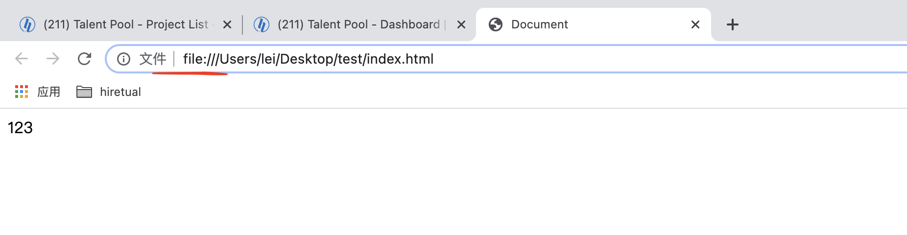
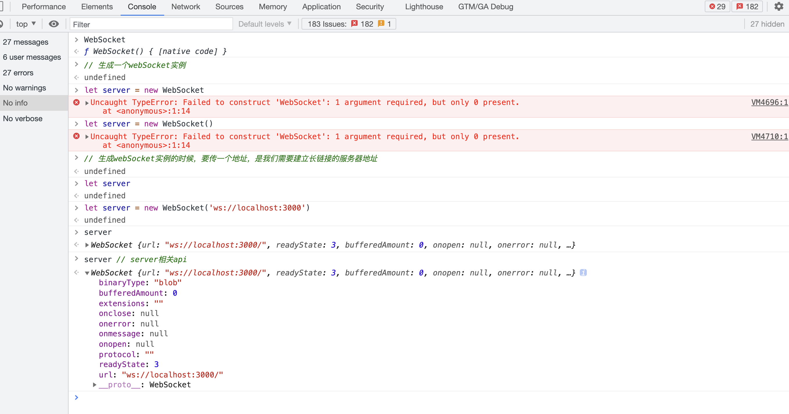
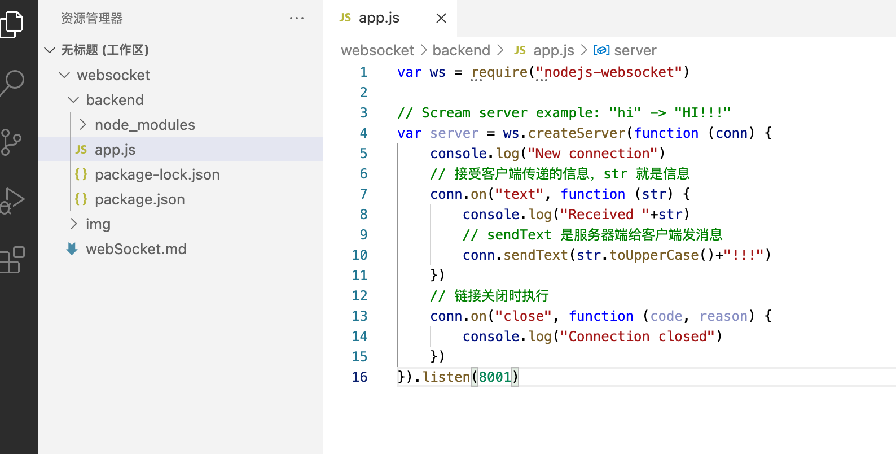

# webSocket是什么？

H5 新增的api

webSocket 是一种在单个TCP连接上进行全双工通信(什么是全双工通信？)的协议。

WebSocket 协议规范将`ws`(WebSocket) 和`wss`(WebSocket Secure) 定义为两个新的[统一资源标识符](https://en.wikipedia.org/wiki/Uniform_resource_identifier)(URI) 方案，分别用于未加密和加密连接。

webSocket 的特点：不受同源策略的影响

### 接触过的协议

+ http
+ https
+ file
+ ws
+ wss
+ ftp: File Transfer Protocol，文件传输协议，其实没有见过

file协议容易忘，比如在本地新建一个index.html，在浏览器端打开




http的缺陷，服务器不能主动给客户端发信息，只能客户端主动给服务器发信息。

平时聊天的情形是张三给李四发消息，是张三先把消息发送给服务器，然后服务器再把消息发送给李四，这时候就涉及到服务器要给客户端发送消息，没有webSocket之前，使用的是ajax轮询。什么是ajax轮询？李四，过一段时间问一下服务器，张三有没有给我发消息，如果没有就没有了，如果有消息就响应给李四。


我们可以在浏览器的控制台找到WebSocket，是一个构造函数




### websock相关api

```js
let server = new WebSocket('服务器地址');

// 监听的事件
// 链接建立成功后会触发
server.onopen = function(){};

// 接受服务器端给客户端发送的消息
server.onmessage = function(info){};

// 链接出现错误
server.onerror = function(){};

// 断开链接
server.onclose = function(){};

// 方法
// 关闭链接
server.close();

// 客户端给服务器端发消息
server.send();
```


### 使用

#### 自己简单写一个后台(node + [nodejs-websocket](https://www.npmjs.com/package/nodejs-websocket))

```js
mkdir backend
cd backend
npm init -y
npm i nodejs-websocket -S
```


这是文件的层级关系，文件内容在npm--> nodejs-websocket 官网上可以找到

就可以启动服务了

```js
lei@leideMacBook-Pro backend % nodemon app
```





#### 客户端

刚开始的客户端内容

```html
<!DOCTYPE html>
<html lang="en">
<head>
    <meta charset="UTF-8">
    <meta http-equiv="X-UA-Compatible" content="IE=edge">
    <meta name="viewport" content="width=device-width, initial-scale=1.0">
    <title>Document</title>
</head>
<body>
    <script>
        let ws = new WebSocket('ws://localhost:8001');
        ws.onopen = function() {
            console.log('链接建立成功');
        }

        ws.onmessage = function(data) {
            console.log('接受过来的数据：', data);
        }

        ws.send('你是服务端吗？')
    </script>
</body>
</html>
```


然后在浏览器打开这个文件，通过file协议


可以看到控制台报错了

因为链接还没有建立成功，websocket现在还是connecting的状态，不能使用send方法


> 通常在实例化一个websocket对象之后，客户端就会与服务器进行连接。但是连接的状态是不确定的，于是用readyState属性来进行标识。它有四个值，分别对应不同的状态：
>
> CONNECTING：值为0，表示正在连接；
> OPEN：值为1，表示连接成功，可以通信了；
> CLOSING：值为2，表示连接正在关闭；
> CLOSED：值为3，表示连接已经关闭，或者打开连接失败。
> ————————————————
> 版权声明：本文为CSDN博主「benben_2015」的原创文章，遵循CC 4.0 BY-SA版权协议，转载请附上原文出处链接及本声明。
> 原文链接：https://blog.csdn.net/benben_2015/article/details/79294547


接下来，改前端代码

```html
<!DOCTYPE html>
<html lang="en">
<head>
    <meta charset="UTF-8">
    <meta http-equiv="X-UA-Compatible" content="IE=edge">
    <meta name="viewport" content="width=device-width, initial-scale=1.0">
    <title>Document</title>
</head>
<body>
    <script>
        let ws = new WebSocket('ws://localhost:8001');
        ws.onopen = function() {
            console.log('链接建立成功');
            ws.send('你是服务端吗？')
        }

        ws.onmessage = function(data) {
            console.log('接受过来的数据：', data);
        }

        // ws.send('你是服务端吗？')
    </script>
</body>
</html>
```

前后端重新运行，先是服务器，再是客户端

这个时候，就可以成功链接，可以看到浏览器控制台，和服务器打印的数据


